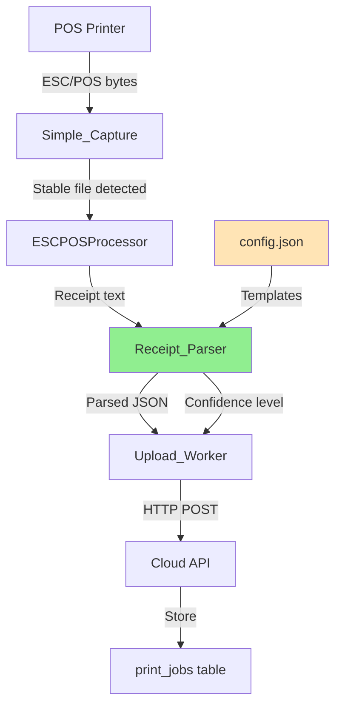

# Design Document: Local Receipt Parsing

## Overview

This feature moves receipt parsing from the cloud to TabezaConnect (local Windows service), eliminating PostgreSQL null byte errors, reducing bandwidth usage, and improving processing efficiency. The design introduces a configurable regex-based parser that extracts structured data from ESC/POS receipt text before uploading to the cloud.

### Key Benefits

- Eliminates null byte errors (PostgreSQL code 22P05) by parsing text locally
- Reduces upload payload size by sending structured JSON instead of raw base64
- Decreases cloud processing overhead by offloading parsing to the edge
- Provides configurable templates for different POS receipt formats
- Maintains backward compatibility with existing TabezaConnect versions

### Design Principles

- **Never reject a receipt**: Parsing failures result in low-confidence data, not errors
- **Configurable templates**: Support multiple POS formats through regex patterns
- **Graceful degradation**: Cloud fallback when local parsing is unavailable
- **Zero breaking changes**: Existing functionality remains intact

## Architecture

### Current Flow (Before)

```
POS Printer → ESC/POS bytes → TabezaConnect
  → Base64 encode → Upload to Cloud API
    → Cloud parses base64 → Extract text → Parse with DeepSeek/Regex
      → Store in print_jobs table
```

### New Flow (After)

```
POS Printer → ESC/POS bytes → TabezaConnect
  → ESCPOSProcessor (convert to text)
    → Receipt_Parser (extract structured data using templates)
      → Upload parsed JSON + optional rawData to Cloud API
        → Cloud uses parsed data directly (skip parsing)
          → Store in print_jobs table
```

### Component Interaction



## Components and Interfaces

### 1. Receipt_Parser Module

**Location**: `packages/printer-service/lib/receiptParser.js`

**Purpose**: Extract structured data from receipt text using configurable regex templates

**Interface**:

```javascript
/**
 * Parse receipt text into structured data
 * @param {string} receiptText - Raw receipt text from ESCPOSProcessor
 * @param {object} template - Parsing template with regex patterns
 * @returns {object} Parsed receipt data with confidence level
 */
function parseReceipt(receiptText, template) {
  return {
    items: [
      { name: string, quantity: number, price: number }
    ],
    total: number,
    subtotal: number,
    tax: number,
    receiptNumber: string,
    timestamp: string,
    confidence: 'high' | 'medium' | 'low',
    rawText: string
  };
}

/**
 * Format parsed data back into readable receipt text
 * @param {object} parsedData - Structured receipt data
 * @returns {string} Formatted receipt text
 */
function formatReceipt(parsedData) {
  return string; // Formatted receipt text
}

/**
 * Validate regex pattern before use
 * @param {string} pattern - Regex pattern to validate
 * @returns {boolean} True if valid
 */
function validatePattern(pattern) {
  return boolean;
}
```

**Confidence Determination Logic**:

- **High**: All fields extracted (items, total, subtotal, tax, receiptNumber, timestamp)
- **Medium**: Partial extraction (items + total OR total only)
- **Low**: Minimal or failed extraction (empty items, zero total)

### 2. Parsing Template Configuration

**Location**: `packages/printer-service/config.json`

**Structure**:

```json
{
  "barId": "uuid",
  "apiUrl": "https://...",
  "driverId": "driver-...",
  "watchFolder": "C:\\Users\\...\\TabezaPrints",
  "parsingTemplate": {
    "receiptNumber": "Receipt\\s*#?:?\\s*(\\S+)",
    "timestamp": "(\\d{1,2}/\\d{1,2}/\\d{4}\\s+\\d{1,2}:\\d{2}(?::\\d{2})?(?:\\s*[AP]M)?)",
    "items": {
      "pattern": "^(\\d+)\\s+(.+?)\\s+(\\d+\\.\\d{2})$",
      "multiline": true,
      "startMarker": "QTY\\s+ITEM\\s+AMOUNT",
      "endMarker": "^-{3,}|Subtotal|Total"
    },
    "subtotal": "Subtotal:?\\s*(\\d+\\.\\d{2})",
    "tax": "(?:VAT|Tax):?\\s*\\(?\\d+%?\\)?\\s*(\\d+\\.\\d{2})",
    "total": "TOTAL:?\\s*(\\d+\\.\\d{2})"
  }
}
```

**Default Template**: Provided for common POS formats (Tusker Lager test receipt format)

### 3. ESCPOSProcessor Integration

**Current**: Already exists in TabezaConnect, converts ESC/POS bytes to text

**Modification**: None required - already provides text output

**Interface** (existing):

```javascript
// Assumed interface based on current usage
function convertToText(escposBytes) {
  return string; // Plain text receipt
}
```

### 4. Upload_Worker Modifications

**Location**: `packages/printer-service/index.js` (processPrintJob function)

**Current Payload**:

```javascript
{
  driverId: string,
  barId: string,
  timestamp: string,
  rawData: string, // base64 encoded
  printerName: string,
  documentName: string,
  metadata: object
}
```

**New Payload**:

```javascript
{
  driverId: string,
  barId: string,
  timestamp: string,
  parsedData: {  // NEW: Primary field
    items: array,
    total: number,
    subtotal: number,
    tax: number,
    receiptNumber: string,
    timestamp: string,
    rawText: string
  },
  rawData: string, // OPTIONAL: For debugging/fallback
  printerName: string,
  documentName: string,
  metadata: {
    ...existing,
    confidence: 'high' | 'medium' | 'low',  // NEW
    parsingMethod: 'local' | 'cloud'  // NEW
  }
}
```

### 5. Cloud API Modifications

**Location**: `apps/staff/app/api/printer/relay/route.ts`

**Current Logic**:

1. Receive payload with rawData
2. Decode base64 → text
3. Parse with DeepSeek/Regex
4. Store in print_jobs

**New Logic**:

1. Receive payload with parsedData (optional) and rawData (optional)
2. **If parsedData exists**: Use directly, skip parsing
3. **If parsedData missing**: Decode rawData and parse locally (backward compatibility)
4. Store in print_jobs with confidence metadata

**Modified Interface**:

```typescript
interface PrintJobPayload {
  driverId: string;
  barId: string;
  timestamp: string;
  parsedData?: ParsedReceipt;  // NEW: Optional parsed data from local
  rawData?: string;  // MODIFIED: Now optional
  printerName: string;
  documentName: string;
  metadata: {
    confidence?: 'high' | 'medium' | 'low';
    parsingMethod?: 'local' | 'cloud';
    [key: string]: any;
  };
}
```

## Data Models

### ParsedReceipt Type

```typescript
interface ParsedReceipt {
  items: ReceiptItem[];
  total: number;
  subtotal?: number;
  tax?: number;
  receiptNumber?: string;
  timestamp?: string;
  rawText: string;
  confidence?: 'high' | 'medium' | 'low';
}

interface ReceiptItem {
  name: string;
  quantity: number;
  price: number;
}
```

### ParsingTemplate Type

```typescript
interface ParsingTemplate {
  receiptNumber?: string;  // Regex pattern
  timestamp?: string;  // Regex pattern
  items: {
    pattern: string;  // Regex with capture groups
    multiline: boolean;
    startMarker?: string;  // Regex to detect items section start
    endMarker?: string;  // Regex to detect items section end
  };
  subtotal?: string;  // Regex pattern
  tax?: string;  // Regex pattern
  total: string;  // Regex pattern (required)
}
```

### Database Schema (print_jobs table)

**No changes required** - existing schema already supports:

```sql
CREATE TABLE print_jobs (
  id UUID PRIMARY KEY,
  bar_id UUID REFERENCES bars(id),
  driver_id TEXT,
  raw_data TEXT,  -- Base64 encoded (now optional)
  parsed_data JSONB,  -- Already exists
  printer_name TEXT,
  document_name TEXT,
  metadata JSONB,  -- Will include confidence and parsingMethod
  status TEXT,
  received_at TIMESTAMPTZ,
  created_at TIMESTAMPTZ DEFAULT NOW()
);
```

## Correctness Properties

*A property is a characteristic or behavior that should hold true across all valid executions of a system—essentially, a formal statement about what the system should do. Properties serve as the bridge between human-readable specifications and machine-verifiable correctness guarantees.*


### Property Reflection

After analyzing all 70 acceptance criteria, I identified the following redundancies and consolidations:

**Redundancy Group 1: Confidence Level Determination**
- Properties 1.2, 1.3, 1.4 all test confidence calculation with different inputs
- **Consolidation**: Combine into single property testing confidence across all scenarios

**Redundancy Group 2: Preservation Properties**
- Properties 3.4, 3.5, 3.6, 4.4, 4.5, 5.6 all test "preserve existing functionality"
- **Consolidation**: These are important but can be tested through integration tests rather than individual properties

**Redundancy Group 3: Backward Compatibility**
- Properties 4.7, 5.7, 6.1, 6.3 all test backward compatibility
- **Consolidation**: Combine into single property about old payload format support

**Redundancy Group 4: Error Resilience**
- Properties 1.8, 7.1, 7.3, 7.4, 7.5, 7.6, 7.7 all test "never reject a receipt"
- **Consolidation**: Combine into single property about unconditional receipt acceptance

**Redundancy Group 5: Format Function**
- Properties 9.2, 9.3, 9.4 all test formatReceipt output contains specific fields
- **Consolidation**: Combine into single property about complete field formatting

**Redundancy Group 6: Round-Trip Properties**
- Properties 10.1, 10.2, 10.3 all test round-trip preservation
- **Consolidation**: Property 10.1 subsumes 10.2 and 10.3

After consolidation, we have **25 unique properties** instead of 70.

### Property 1: Parser Return Structure

*For any* receipt text input, the Receipt_Parser should return an object containing fields: items (array), total (number), subtotal (number), tax (number), receiptNumber (string), timestamp (string), confidence (string), and rawText (string).

**Validates: Requirements 1.1**

### Property 2: Confidence Level Determination

*For any* receipt text, the Receipt_Parser should assign confidence "high" when all fields are extracted, "medium" when partial fields are extracted, and "low" when minimal or no fields are extracted.

**Validates: Requirements 1.2, 1.3, 1.4**

### Property 3: Template Configuration Usage

*For any* valid parsing template provided to Receipt_Parser, the parser should use the template's regex patterns to extract fields from receipt text.

**Validates: Requirements 1.5, 2.3**

### Property 4: Multiple Template Support

*For any* array of parsing templates, the Receipt_Parser should attempt parsing with each template until one succeeds or all fail.

**Validates: Requirements 1.6**

### Property 5: Never Throw Exceptions

*For any* input (valid or invalid), the Receipt_Parser should never throw exceptions and should always return a result object with at least low confidence data.

**Validates: Requirements 1.8, 7.1, 7.3**

### Property 6: Template Structure Validation

*For any* parsing template object, it should contain at minimum a "total" pattern and optionally patterns for receiptNumber, items, subtotal, tax, and timestamp.

**Validates: Requirements 2.2**

### Property 7: Default Template Fallback

*For any* parsing request without a custom template, the Receipt_Parser should use the built-in default template.

**Validates: Requirements 2.5**

### Property 8: Regex Capture Group Extraction

*For any* template with regex capture groups, the Receipt_Parser should extract the captured values and assign them to the corresponding fields.

**Validates: Requirements 2.6**

### Property 9: Multi-line Item Extraction

*For any* receipt with multiple item lines matching the items pattern, the Receipt_Parser should extract all items into the items array.

**Validates: Requirements 2.7**

### Property 10: Processing Pipeline Integration

*For any* stable receipt file detected by Simple_Capture, the system should call ESCPOSProcessor to convert bytes to text, then call Receipt_Parser to extract structured data, then pass the result to Upload_Worker.

**Validates: Requirements 3.1, 3.2, 3.3**

### Property 11: Unconditional Receipt Processing

*For any* receipt (regardless of parsing success or failure), the system should enqueue it for upload with either parsed data or low-confidence fallback data.

**Validates: Requirements 3.7, 7.4, 7.5, 7.6, 7.7**

### Property 12: Parsed Data in Payload

*For any* upload request from Upload_Worker, the payload should include parsedData as a primary field when parsing succeeded.

**Validates: Requirements 4.1, 4.6**

### Property 13: Optional Raw Data

*For any* upload request, rawData should be optional and the request should succeed even when rawData is omitted.

**Validates: Requirements 4.2**

### Property 14: Confidence in Metadata

*For any* upload request with parsed data, the metadata should include the confidence level (high, medium, or low).

**Validates: Requirements 4.3**

### Property 15: Backward Compatible Payloads

*For any* old-format payload (with only rawData, no parsedData), the Cloud API should accept it and process it using the existing parsing logic.

**Validates: Requirements 4.7, 5.7, 6.1, 6.3**

### Property 16: Cloud API Accepts Parsed Data

*For any* request to Cloud API with parsedData field, the API should accept it and use it directly without re-parsing.

**Validates: Requirements 5.1, 5.3**

### Property 17: Cloud API Optional Raw Data

*For any* request to Cloud API without rawData field, the API should accept it when parsedData is provided.

**Validates: Requirements 5.2**

### Property 18: Cloud API Fallback Parsing

*For any* request to Cloud API without parsedData, the API should decode rawData and parse it using the existing local parsing logic.

**Validates: Requirements 5.4, 6.1**

### Property 19: Parsed Data Storage

*For any* accepted print job, the Cloud API should store the parsedData in the print_jobs.parsed_data column.

**Validates: Requirements 5.5**

### Property 20: Parsing Method Priority

*For any* request with both parsedData and rawData, the Cloud API should prioritize parsedData and skip rawData parsing.

**Validates: Requirements 6.2, 6.6**

### Property 21: Parsing Method Logging

*For any* print job processed by Cloud API, the system should log whether local parsing (from TabezaConnect) or cloud parsing was used.

**Validates: Requirements 6.4**

### Property 22: Regex Pattern Validation

*For any* regex pattern in a parsing template, the Receipt_Parser should validate it before use and fall back to the default pattern if invalid.

**Validates: Requirements 8.4, 8.5**

### Property 23: Format Receipt Function

*For any* valid parsed data object, the formatReceipt function should return a readable text string containing all non-empty fields (items, totals, receipt number, timestamp).

**Validates: Requirements 9.1, 9.2, 9.3, 9.4, 9.6**

### Property 24: Format Handles Missing Fields

*For any* parsed data object with missing or empty fields, the formatReceipt function should handle them gracefully without errors.

**Validates: Requirements 9.7**

### Property 25: Round-Trip Parsing Consistency

*For any* valid receipt text, parsing it, then formatting the result, then parsing again should produce parsed data equivalent to the original (allowing for minor formatting differences in whitespace and decimal precision).

**Validates: Requirements 10.1, 10.2, 10.3, 10.7**

## Error Handling

### Parsing Errors

**Strategy**: Never reject a receipt due to parsing failure

**Implementation**:

1. **Invalid Input**: Return low confidence data with empty fields
2. **Regex Errors**: Validate patterns before use, fall back to default
3. **Template Errors**: Use default template if custom template fails
4. **Null Byte Errors**: Eliminated by parsing locally before upload

**Error Response Format**:

```javascript
{
  items: [],
  total: 0,
  subtotal: 0,
  tax: 0,
  receiptNumber: '',
  timestamp: '',
  confidence: 'low',
  rawText: originalText,
  error: errorMessage  // Optional, for debugging
}
```

### Upload Errors

**Strategy**: Preserve existing retry logic with exponential backoff

**Implementation**:

1. **Network Errors**: Retry with exponential backoff (existing behavior)
2. **API Errors**: Log and retry (existing behavior)
3. **Validation Errors**: Log but don't retry (existing behavior)

**No changes to existing error handling** - local parsing reduces errors but doesn't change retry behavior.

### Cloud API Errors

**Strategy**: Accept all receipts regardless of parsing quality

**Implementation**:

1. **Missing parsedData**: Fall back to rawData parsing (backward compatibility)
2. **Missing rawData**: Accept if parsedData is provided
3. **Both missing**: Return 400 error (existing behavior)
4. **Parsing failure**: Store with low confidence (existing behavior)

**Structured Error Response** (existing):

```typescript
interface ErrorResponse {
  success: false;
  error: string;
  category: 'validation' | 'decoding' | 'parsing' | 'database' | 'configuration';
  operation: string;
  details?: Record<string, any>;
}
```

### Logging Strategy

**Local (TabezaConnect)**:

- Log parsing attempts with confidence levels
- Log template validation failures
- Log regex errors with pattern details
- Log round-trip validation failures

**Cloud (API)**:

- Log parsing method used (local vs cloud)
- Log confidence levels for observability
- Log backward compatibility usage
- Preserve existing structured error logging

## Testing Strategy

### Dual Testing Approach

This feature requires both unit tests and property-based tests for comprehensive coverage:

**Unit Tests**: Focus on specific examples, edge cases, and integration points
- Default template parsing with sample receipts
- Config file loading and validation
- API endpoint backward compatibility
- Database storage verification
- Error logging verification

**Property-Based Tests**: Verify universal properties across all inputs
- Use fast-check library (already in printer-service dependencies)
- Minimum 100 iterations per property test
- Each test references its design document property

### Property-Based Testing Configuration

**Library**: fast-check (JavaScript/TypeScript)

**Test Structure**:

```javascript
const fc = require('fast-check');

describe('Receipt Parser Properties', () => {
  it('Property 1: Parser Return Structure', () => {
    // Feature: local-receipt-parsing, Property 1: Parser Return Structure
    fc.assert(
      fc.property(
        fc.string(), // Arbitrary receipt text
        (receiptText) => {
          const result = parseReceipt(receiptText, defaultTemplate);
          
          // Verify structure
          expect(result).toHaveProperty('items');
          expect(result).toHaveProperty('total');
          expect(result).toHaveProperty('confidence');
          expect(Array.isArray(result.items)).toBe(true);
          expect(typeof result.total).toBe('number');
          expect(['high', 'medium', 'low']).toContain(result.confidence);
        }
      ),
      { numRuns: 100 }
    );
  });
  
  it('Property 5: Never Throw Exceptions', () => {
    // Feature: local-receipt-parsing, Property 5: Never Throw Exceptions
    fc.assert(
      fc.property(
        fc.anything(), // Any input including invalid
        (input) => {
          expect(() => {
            parseReceipt(input, defaultTemplate);
          }).not.toThrow();
        }
      ),
      { numRuns: 100 }
    );
  });
  
  it('Property 25: Round-Trip Parsing Consistency', () => {
    // Feature: local-receipt-parsing, Property 25: Round-Trip Parsing Consistency
    fc.assert(
      fc.property(
        receiptArbitrary(), // Custom arbitrary for valid receipts
        (receipt) => {
          const parsed1 = parseReceipt(receipt, defaultTemplate);
          const formatted = formatReceipt(parsed1);
          const parsed2 = parseReceipt(formatted, defaultTemplate);
          
          // Allow minor differences in whitespace and decimals
          expect(parsed2.items.length).toBe(parsed1.items.length);
          expect(Math.abs(parsed2.total - parsed1.total)).toBeLessThan(0.01);
        }
      ),
      { numRuns: 100 }
    );
  });
});
```

### Custom Arbitraries

**Receipt Generator**:

```javascript
const receiptArbitrary = () => fc.record({
  receiptNumber: fc.string({ minLength: 5, maxLength: 20 }),
  timestamp: fc.date().map(d => d.toISOString()),
  items: fc.array(
    fc.record({
      name: fc.string({ minLength: 3, maxLength: 50 }),
      quantity: fc.integer({ min: 1, max: 10 }),
      price: fc.float({ min: 0.01, max: 10000, noNaN: true })
    }),
    { minLength: 1, maxLength: 20 }
  ),
  subtotal: fc.float({ min: 0.01, max: 100000, noNaN: true }),
  tax: fc.float({ min: 0, max: 10000, noNaN: true }),
  total: fc.float({ min: 0.01, max: 110000, noNaN: true })
}).map(data => formatReceipt(data)); // Generate text from structured data
```

### Unit Test Coverage

**Receipt Parser Module**:
- ✅ Parse sample receipt with all fields
- ✅ Parse receipt with missing fields
- ✅ Parse malformed receipt
- ✅ Validate regex patterns
- ✅ Use default template when none provided
- ✅ Format parsed data back to text
- ✅ Handle null/undefined inputs

**Integration Tests**:
- ✅ End-to-end flow: file → parse → upload → store
- ✅ Backward compatibility: old payload format
- ✅ Error recovery: parsing failure → low confidence upload
- ✅ Config loading: custom templates from config.json

**API Tests**:
- ✅ Accept parsedData without rawData
- ✅ Accept rawData without parsedData (backward compat)
- ✅ Prioritize parsedData when both present
- ✅ Store confidence level in metadata
- ✅ Log parsing method used

### Test Data

**Sample Receipts** (in `test-receipts/` directory):

1. `tusker-test-receipt.txt` - Default template format
2. `captain-orders-receipt.txt` - Captain's Orders format
3. `minimal-receipt.txt` - Only total, no items
4. `malformed-receipt.txt` - Invalid format
5. `empty-receipt.txt` - Empty file

### Testing Commands

```bash
# Run all tests
cd packages/printer-service && npm test

# Run property-based tests only
cd packages/printer-service && npm test -- --testNamePattern="Property"

# Run with coverage
cd packages/printer-service && npm test -- --coverage

# Run integration tests
cd packages/printer-service && npm run test:integration
```

### Success Criteria

- All 25 properties pass with 100 iterations
- Unit test coverage > 80%
- Integration tests pass end-to-end
- Backward compatibility tests pass
- No receipts rejected due to parsing failures

