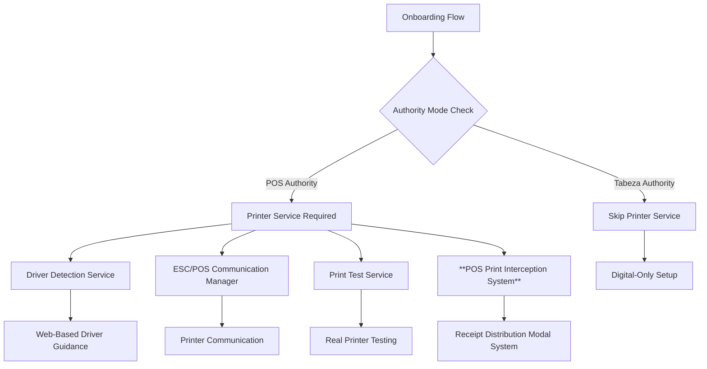
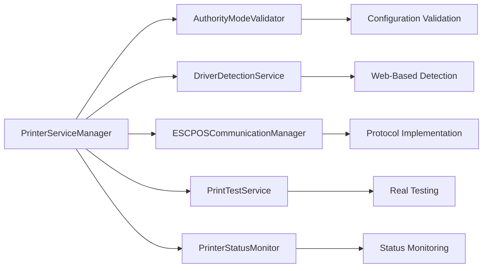

# Design Document: Printer Driver Implementation

## Overview

This design implements actual printer driver detection, installation guidance, and ESC/POS protocol communication for Tabeza's thermal printer integration. The implementation is authority-aware, only requiring printer functionality for POS authority modes (Basic mode and Venue+POS mode) while completely bypassing printer requirements for Venue+Tabeza mode.

The design integrates seamlessly with the existing BasicSetup.tsx onboarding component, replacing the current simulated printer testing with real driver detection and printer communication functionality.

## Architecture

### Essential Tabeza Basic Workflow Architecture

The core architecture centers around a **Virtual Printer Driver** that intercepts POS print jobs:

```mermaid
graph TB
    A[POS System] --> B["Prints to 'Tabeza Receipt Printer'"]
    B --> C[Tabeza Virtual Driver Intercepts]
    C --> D[Receipt Distribution Modal]
    D --> E{Staff Choice}
    E -->|Physical Receipt| F[Forward to Real Thermal Printer]
    E -->|Tabeza Digital| G[Customer Selection Modal]
    G --> H[Show Connected Customers/Tabs]
    H --> I[Staff Selects Customer(s)]
    I --> J[Digital Receipt Delivery]
    J --> K[Delivery Confirmation]
    F --> L[Modal Closes]
    K --> L
```

### Technical Implementation Details

**Virtual Printer Driver Setup:**
1. **Installation**: Tabeza installs a virtual printer driver that appears as "Tabeza Receipt Printer" in Windows
2. **POS Configuration**: Venues configure their POS system to print to "Tabeza Receipt Printer" instead of the physical printer
3. **Print Interception**: The virtual driver captures all print jobs before they reach any physical printer
4. **Modal Trigger**: Each intercepted print job triggers the receipt distribution modal
5. **Print Routing**: Based on staff selection, jobs are either forwarded to the real printer or converted to digital receipts

### Authority-Based Printer Service Architecture



### Service Layer Architecture



## Components and Interfaces

### Essential Workflow Interfaces

```typescript
// CORE TRUTH: Manual service always exists. Digital authority is singular. 
// Tabeza adapts to the venue — never the reverse.

interface TabezaVirtualPrinterDriver {
  // Virtual printer installation and management
  installVirtualPrinter(): Promise<InstallationResult>;
  uninstallVirtualPrinter(): Promise<void>;
  isVirtualPrinterInstalled(): Promise<boolean>;
  
  // Print job interception
  interceptPrintJob(printJob: PrintJob): Promise<InterceptionResult>;
  forwardToPhysicalPrinter(printJob: PrintJob, printerName: string): Promise<void>;
  
  // Print data parsing
  parsePrintData(rawData: Buffer): Promise<ParsedReceiptData>;
}

interface PrintJob {
  jobId: string;
  printerName: string; // "Tabeza Receipt Printer"
  rawData: Buffer;
  timestamp: Date;
  documentName: string;
  pageCount: number;
}

interface ParsedReceiptData {
  receiptType: 'order' | 'payment' | 'refund' | 'other';
  content: string;
  items: ReceiptItem[];
  total: number;
  metadata: {
    posSystemId?: string;
    transactionId?: string;
    timestamp: Date;
  };
}

interface POSPrintInterceptionService {
  // Core print interception functionality
  interceptPrintCommand(printData: POSPrintData): Promise<InterceptionResult>;
  showReceiptDistributionModal(printData: POSPrintData): Promise<DistributionChoice>;
  showCustomerSelectionModal(connectedCustomers: ConnectedCustomer[]): Promise<CustomerSelection>;
  
  // Digital receipt delivery
  deliverDigitalReceipt(customers: ConnectedCustomer[], receiptData: ReceiptData): Promise<DeliveryResult>;
  confirmDelivery(deliveryId: string): Promise<DeliveryConfirmation>;
}

interface DistributionChoice {
  choice: 'physical' | 'digital';
  timestamp: Date;
  staffId?: string;
}

interface ConnectedCustomer {
  customerId: string;
  tabId: string;
  tabNumber: number;
  connectionStatus: 'connected' | 'idle' | 'disconnected';
  deviceInfo: {
    type: 'mobile' | 'desktop';
    lastSeen: Date;
  };
  customerIdentifier: string; // Display name for staff
}

interface CustomerSelection {
  selectedCustomers: ConnectedCustomer[];
  deliveryMethod: 'immediate' | 'queued';
  staffNotes?: string;
}

interface DeliveryResult {
  deliveryId: string;
  successful: ConnectedCustomer[];
  failed: {
    customer: ConnectedCustomer;
    error: string;
  }[];
  timestamp: Date;
}

interface POSPrintData {
  receiptContent: string;
  printJobId: string;
  timestamp: Date;
  posSystemId: string;
  receiptType: 'order' | 'payment' | 'refund' | 'other';
}

interface InstallationResult {
  success: boolean;
  printerName: string;
  error?: string;
}

interface InterceptionResult {
  intercepted: boolean;
  printJobId: string;
  action: 'forwarded' | 'digitized' | 'cancelled';
}
```

### Core Service Interface

```typescript
// CORE TRUTH: Manual service always exists. Digital authority is singular. 
// Tabeza adapts to the venue — never the reverse.

interface PrinterServiceManager {
  // Authority-based service activation
  isServiceRequired(venueMode: VenueMode, authorityMode: AuthorityMode): boolean;
  
  // Driver detection and guidance
  detectDrivers(): Promise<DriverDetectionResult>;
  getInstallationGuidance(platform: Platform): InstallationGuidance;
  
  // Printer communication (POS authority only)
  establishConnection(config: PrinterConfig): Promise<PrinterConnection>;
  testPrinter(connection: PrinterConnection): Promise<TestResult>;
  
  // Status monitoring (POS authority only)
  monitorStatus(connection: PrinterConnection): Observable<PrinterStatus>;
}

interface DriverDetectionService {
  // Web-compatible driver detection
  detectPlatform(): Platform;
  checkDriverAvailability(): Promise<DriverStatus>;
  generateInstallationGuidance(platform: Platform): InstallationGuidance;
}

interface ESCPOSCommunicationManager {
  // ESC/POS protocol implementation
  formatReceiptData(receiptData: ReceiptData): ESCPOSCommand[];
  sendCommands(connection: PrinterConnection, commands: ESCPOSCommand[]): Promise<void>;
  queryCapabilities(connection: PrinterConnection): Promise<PrinterCapabilities>;
}

interface PrintTestService {
  // Real printer testing
  generateTestReceipt(venueInfo: VenueInfo): ReceiptData;
  executePrintTest(connection: PrinterConnection, testData: ReceiptData): Promise<TestResult>;
}
```

### Authority Mode Integration

```typescript
interface AuthorityModeValidator {
  validatePrinterRequirement(config: VenueConfiguration): PrinterRequirement;
  shouldSkipPrinterSetup(venueMode: VenueMode, authorityMode: AuthorityMode): boolean;
}

type PrinterRequirement = 
  | { required: true; reason: 'basic_mode' | 'venue_pos_integration' }
  | { required: false; reason: 'venue_tabeza_mode' };

interface VenueConfiguration {
  venue_mode: 'basic' | 'venue';
  authority_mode: 'pos' | 'tabeza';
  pos_integration_enabled: boolean;
  printer_required: boolean;
}
```

### Web-Based Driver Detection

```typescript
interface DriverDetectionService {
  // Platform detection through browser APIs
  detectPlatform(): Platform;
  
  // Web-compatible driver status checking
  checkDriverStatus(): Promise<DriverDetectionResult>;
  
  // Installation guidance generation
  generateGuidance(platform: Platform): InstallationGuidance;
}

interface Platform {
  os: 'windows' | 'macos' | 'linux' | 'ios' | 'android' | 'unknown';
  browser: string;
  version: string;
  supportsDrivers: boolean;
}

interface DriverDetectionResult {
  platform: Platform;
  driversRequired: boolean;
  driversDetected: boolean;
  installationGuidance?: InstallationGuidance;
  manualVerificationRequired: boolean;
}

interface InstallationGuidance {
  downloadUrl: string;
  instructions: string[];
  troubleshootingSteps: string[];
  verificationSteps: string[];
}
```

## Data Models

### Printer Configuration Models

```typescript
interface PrinterConfig {
  printerName: string;
  connectionType: 'usb' | 'network' | 'bluetooth';
  ipAddress?: string;
  port?: number;
  tested: boolean;
  capabilities?: PrinterCapabilities;
}

interface PrinterCapabilities {
  paperWidth: number;
  characterSets: string[];
  supportedFeatures: PrinterFeature[];
  maxLineLength: number;
}

interface PrinterConnection {
  id: string;
  config: PrinterConfig;
  status: 'connected' | 'disconnected' | 'error';
  lastError?: string;
}

interface TestResult {
  success: boolean;
  timestamp: Date;
  error?: string;
  printQuality?: 'good' | 'poor' | 'failed';
}
```

### ESC/POS Protocol Models

```typescript
interface ESCPOSCommand {
  type: 'text' | 'cut' | 'feed' | 'align' | 'font' | 'barcode';
  data: string | number;
  parameters?: Record<string, any>;
}

interface ReceiptData {
  header: ReceiptSection;
  items: ReceiptItem[];
  footer: ReceiptSection;
  metadata: ReceiptMetadata;
}

interface ReceiptSection {
  lines: string[];
  alignment: 'left' | 'center' | 'right';
  font: 'normal' | 'bold' | 'large';
}

interface ReceiptMetadata {
  venueInfo: VenueInfo;
  timestamp: Date;
  testMode: boolean;
}
```

## Correctness Properties

*A property is a characteristic or behavior that should hold true across all valid executions of a system-essentially, a formal statement about what the system should do. Properties serve as the bridge between human-readable specifications and machine-verifiable correctness guarantees.*

Now I need to use the prework tool to analyze the acceptance criteria before writing the correctness properties.

<function_calls>
<invoke name="prework">
<parameter name="featureName">printer-driver-implementation

### Property Reflection

After reviewing all properties identified in the prework analysis, I need to eliminate redundancy and consolidate related properties:

**Redundancy Analysis:**
- Properties 1.1, 1.2, and 1.3 can be consolidated into a single comprehensive authority-based driver requirement property
- Properties 3.1 and 3.6 can be combined into one property about ESC/POS activation based on authority mode
- Properties 4.1 and 4.5 can be combined into one property about test execution based on authority mode
- Properties 5.1 and 5.5 can be combined into one property about capability detection based on authority mode
- Properties 6.1 and 6.5 can be combined into one property about status monitoring based on authority mode
- Properties 7.1 and 7.5 can be combined into one property about print queue management based on authority mode

**Consolidated Properties:**
The final set eliminates redundant inverse properties and combines related functionality into comprehensive properties that validate both positive and negative cases.

### Correctness Properties

Property 1: Authority-based driver requirements
*For any* venue configuration, printer drivers should be required if and only if the venue uses POS authority mode (basic mode or venue+POS mode)
**Validates: Requirements 1.1, 1.2, 1.3**

Property 2: Driver installation guidance display
*For any* venue configuration that requires printer drivers, the system should display installation guidance with tabeza.co.ke download links
**Validates: Requirements 1.4**

Property 3: Driver setup step visibility
*For any* venue configuration, driver-related setup steps should be visible if and only if printer drivers are required for that configuration
**Validates: Requirements 1.5**

Property 4: Platform detection for driver requirements
*For any* POS authority mode configuration, the system should detect the user's operating system when drivers are required
**Validates: Requirements 2.1**

Property 5: Manual verification fallback
*For any* configuration where driver detection fails, the system should provide manual verification steps
**Validates: Requirements 2.2**

Property 6: OS-specific installation guidance
*For any* detected platform requiring drivers, the system should generate platform-specific download links and instructions
**Validates: Requirements 2.3**

Property 7: Driver confirmation workflow
*For any* configuration requiring drivers, the system should provide confirmation options and proceed to printer testing upon confirmation
**Validates: Requirements 2.4, 2.5**

Property 8: Authority-based ESC/POS activation
*For any* venue configuration, ESC/POS communication should be active if and only if authority_mode is 'pos'
**Validates: Requirements 3.1, 3.6**

Property 9: ESC/POS receipt formatting
*For any* POS authority mode configuration, receipt data should be formatted according to ESC/POS standards
**Validates: Requirements 3.2**

Property 10: Network printer communication
*For any* network printer configuration, the system should establish TCP/IP communication on specified ports
**Validates: Requirements 3.3**

Property 11: USB printer driver communication
*For any* USB printer configuration in POS authority mode, the system should communicate through installed Tabeza drivers
**Validates: Requirements 3.4**

Property 12: ESC/POS protocol compliance
*For any* printer communication, status responses and error codes should be handled according to ESC/POS specifications
**Validates: Requirements 3.5**

Property 13: Authority-based printer testing
*For any* venue configuration, real printer testing should execute if and only if authority mode requires printer integration
**Validates: Requirements 4.1, 4.5**

Property 14: Test result state management
*For any* printer test execution, success should update printer status to tested and failure should display specific error messages
**Validates: Requirements 4.2, 4.3**

Property 15: Test receipt content validation
*For any* printer test execution, the test receipt should include venue information, timestamp, and test pattern
**Validates: Requirements 4.4**

Property 16: Authority-based capability detection
*For any* venue configuration, printer capability detection should execute if and only if POS authority mode is active
**Validates: Requirements 5.1, 5.5**

Property 17: Printer capability detection completeness
*For any* POS authority mode printer connection, the system should detect paper width, character sets, and supported features
**Validates: Requirements 5.2**

Property 18: Capability-based receipt formatting
*For any* POS receipt formatting operation, layout should adapt based on detected printer capabilities
**Validates: Requirements 5.3**

Property 19: Capability information persistence
*For any* detected printer capabilities, the information should be stored and retrievable for POS integration operations
**Validates: Requirements 5.4**

Property 20: Authority-based status monitoring
*For any* venue configuration, printer status monitoring should be active if and only if POS authority mode is active
**Validates: Requirements 6.1, 6.5**

Property 21: Status change handling
*For any* printer status change in POS mode, the system should display appropriate status indicators and log the changes
**Validates: Requirements 6.2, 6.3**

Property 22: POS operation error handling
*For any* printer error during POS operations, the system should provide specific error descriptions and solutions
**Validates: Requirements 6.4**

Property 23: Authority-based print queue management
*For any* venue configuration, print queue functionality should be active if and only if POS authority mode is active
**Validates: Requirements 7.1, 7.5**

Property 24: Print queue ordering
*For any* multiple POS receipt mirroring requests, the system should process them in first-in-first-out order
**Validates: Requirements 7.2**

Property 25: Print queue retry behavior
*For any* failed POS receipt mirroring job, the system should retry according to configurable retry policies
**Validates: Requirements 7.3**

Property 26: Print queue visibility
*For any* POS authority mode configuration, queue status should be visible to staff for monitoring operations
**Validates: Requirements 7.4**

Property 27: Existing component integration
*For any* enhanced printer functionality, integration with existing BasicSetup.tsx should preserve all existing behavior
**Validates: Requirements 8.1, 8.3, 8.5**

Property 28: Onboarding workflow progression
*For any* printer testing completion, successful tests should continue onboarding flow and failures should prevent progression
**Validates: Requirements 8.2, 8.4**

## Error Handling

### Authority Mode Validation Errors

```typescript
class InvalidAuthorityConfigurationError extends Error {
  constructor(venueMode: VenueMode, authorityMode: AuthorityMode) {
    super(`Invalid configuration: ${venueMode} mode with ${authorityMode} authority`);
  }
}

class PrinterRequirementMismatchError extends Error {
  constructor(config: VenueConfiguration) {
    super(`Printer requirement mismatch for configuration: ${JSON.stringify(config)}`);
  }
}
```

### Driver Detection Errors

```typescript
class DriverDetectionError extends Error {
  constructor(platform: Platform, reason: string) {
    super(`Driver detection failed for ${platform.os}: ${reason}`);
  }
}

class UnsupportedPlatformError extends Error {
  constructor(platform: Platform) {
    super(`Platform ${platform.os} does not support Tabeza printer drivers`);
  }
}
```

### Printer Communication Errors

```typescript
class PrinterConnectionError extends Error {
  constructor(config: PrinterConfig, reason: string) {
    super(`Failed to connect to printer ${config.printerName}: ${reason}`);
  }
}

class ESCPOSProtocolError extends Error {
  constructor(command: ESCPOSCommand, error: string) {
    super(`ESC/POS protocol error for command ${command.type}: ${error}`);
  }
}

class PrintTestFailureError extends Error {
  constructor(printerName: string, error: string) {
    super(`Print test failed for ${printerName}: ${error}`);
  }
}
```

### Error Recovery Strategies

1. **Driver Detection Failures**: Fall back to manual verification with clear installation guidance
2. **Printer Connection Failures**: Provide specific troubleshooting steps based on connection type
3. **ESC/POS Protocol Errors**: Log detailed error information and suggest printer compatibility checks
4. **Print Test Failures**: Display specific error messages with actionable solutions
5. **Authority Mode Mismatches**: Prevent invalid configurations through validation

## Testing Strategy

### Dual Testing Approach

The testing strategy employs both unit tests and property-based tests to ensure comprehensive coverage:

**Unit Tests Focus:**
- Specific examples of authority mode configurations
- Edge cases in driver detection and platform identification
- Error conditions and recovery scenarios
- Integration points with existing BasicSetup.tsx component

**Property-Based Tests Focus:**
- Universal properties across all venue configurations
- Authority-based service activation and deactivation
- ESC/POS protocol compliance across different printer models
- Print queue behavior under various load conditions

### Property-Based Testing Configuration

- **Testing Library**: fast-check for TypeScript/JavaScript property-based testing
- **Test Iterations**: Minimum 100 iterations per property test
- **Test Tagging**: Each property test references its design document property
- **Tag Format**: `Feature: printer-driver-implementation, Property {number}: {property_text}`

### Authority Mode Test Coverage

```typescript
// Example property test structure
describe('Authority-based printer requirements', () => {
  it('should require drivers only for POS authority modes', 
    fc.property(
      venueConfigurationArbitrary(),
      (config) => {
        const requiresDrivers = printerService.isDriverRequired(config);
        const isPOSAuthority = config.authority_mode === 'pos';
        
        expect(requiresDrivers).toBe(isPOSAuthority);
      }
    ), 
    { 
      numRuns: 100,
      // Feature: printer-driver-implementation, Property 1: Authority-based driver requirements
    }
  );
});
```

### Integration Test Requirements

- Test integration with existing BasicSetup.tsx without breaking changes
- Validate onboarding flow progression with real and simulated printer testing
- Test authority mode switching and configuration validation
- Verify error handling and recovery across different failure scenarios

The testing strategy ensures that the printer driver implementation maintains the core truth of authority-based service activation while providing reliable printer integration for POS authority modes.