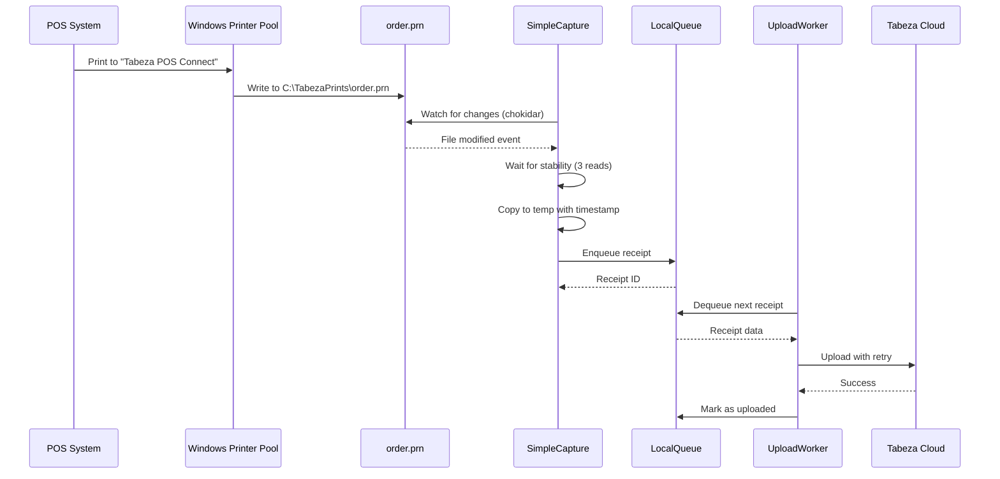

# Design Document: Printer Pooling Integration

## Overview

This design integrates a simplified printer pooling capture mode into TabezaConnect. The pooling mode watches a single capture file (C:\TabezaPrints\order.prn) that receives print data from a Windows printer pool, eliminating the complexity of direct spooler monitoring while maintaining 100% reliability through the Windows print subsystem.

## Main Algorithm/Workflow



## Core Interfaces/Types

```javascript
// SimpleCapture configuration
interface SimpleCaptureOptions {
  captureFile: string;           // Path to order.prn
  tempFolder: string;             // Temp storage for copies
  localQueue: LocalQueue;         // Queue instance
  barId: string;                  // Bar identifier
  deviceId: string;               // Device identifier
  stabilityChecks: number;        // Number of stability reads (default: 3)
  stabilityDelay: number;         // Delay between reads in ms (default: 100)
}

// File stability state
interface StabilityState {
  path: string;
  size: number;
  lastModified: number;
  checksRemaining: number;
  timeoutId: NodeJS.Timeout | null;
}

// Capture statistics
interface CaptureStats {
  filesDetected: number;
  filesCaptured: number;
  filesSkipped: number;
  lastCapture: string | null;
  errors: number;
  lastError: string | null;
}
```

## Key Functions with Formal Specifications

### Function 1: startWatching()

```javascript
async startWatching()
```

**Preconditions:**
- `captureFile` path is valid and accessible
- `tempFolder` exists or can be created
- `localQueue` is initialized
- Service is not already watching

**Postconditions:**
- File watcher is active on `captureFile`
- Returns true if successful
- Emits 'started' event
- All event handlers are registered

**Loop Invariants:** N/A

### Function 2: handleFileChange()

```javascript
async handleFileChange(path: string)
```

**Preconditions:**
- `path` matches `captureFile`
- File exists and is readable
- Watcher is active

**Postconditions:**
- Stability check is initiated or updated
- Previous stability timeout is cleared if exists
- New timeout is scheduled for next stability check
- No duplicate stability checks for same file

**Loop Invariants:** N/A

### Function 3: checkFileStability()

```javascript
async checkFileStability(state: StabilityState)
```

**Preconditions:**
- `state.path` exists and is readable
- `state.checksRemaining` > 0
- File is not currently being processed

**Postconditions:**
- If stable (3 consecutive identical reads): triggers `processStableFile()`
- If unstable: schedules another stability check
- If error: logs error and resets stability state
- Updates `state.checksRemaining` counter

**Loop Invariants:**
- For stability loop: File size and modification time remain constant across checks when stable
- Stability check count decrements by 1 each iteration

### Function 4: processStableFile()

```javascript
async processStableFile(filePath: string)
```

**Preconditions:**
- File at `filePath` is stable (passed 3 consecutive checks)
- File is readable
- `tempFolder` is writable
- `localQueue` is operational

**Postconditions:**
- File is copied to temp folder with unique timestamp
- Receipt is enqueued to `localQueue`
- Original file is NOT deleted (Windows pool manages it)
- Statistics are updated
- Emits 'file-captured' event with receipt ID

**Loop Invariants:** N/A

## Algorithmic Pseudocode

### Main Capture Algorithm

```javascript
ALGORITHM startWatching()
INPUT: None (uses instance configuration)
OUTPUT: boolean (success status)

BEGIN
  ASSERT this.captureFile is valid path
  ASSERT this.localQueue is initialized
  
  // Step 1: Ensure temp folder exists
  IF NOT exists(this.tempFolder) THEN
    createDirectory(this.tempFolder, recursive: true)
  END IF
  
  // Step 2: Initialize file watcher
  this.watcher ← chokidar.watch(this.captureFile, {
    persistent: true,
    ignoreInitial: true,
    awaitWriteFinish: false  // We handle stability ourselves
  })
  
  // Step 3: Register event handlers
  this.watcher.on('change', (path) => this.handleFileChange(path))
  this.watcher.on('error', (error) => this.handleError(error))
  
  // Step 4: Mark as running
  this.isRunning ← true
  
  EMIT 'started' event
  
  RETURN true
END
```

**Preconditions:**
- Configuration is valid
- File system is accessible
- LocalQueue is initialized

**Postconditions:**
- Watcher is active and monitoring file
- Event handlers are registered
- Service is marked as running

**Loop Invariants:** N/A

### File Stability Detection Algorithm

```javascript
ALGORITHM checkFileStability(state)
INPUT: state of type StabilityState
OUTPUT: void (triggers processStableFile if stable)

BEGIN
  ASSERT state.path exists
  ASSERT state.checksRemaining > 0
  
  // Step 1: Read current file stats
  stats ← fs.statSync(state.path)
  currentSize ← stats.size
  currentMtime ← stats.mtimeMs
  
  // Step 2: Compare with previous state
  IF currentSize = state.size AND currentMtime = state.lastModified THEN
    // File is stable for this check
    state.checksRemaining ← state.checksRemaining - 1
    
    IF state.checksRemaining = 0 THEN
      // File is fully stable - process it
      CALL processStableFile(state.path)
      DELETE this.stabilityStates[state.path]
      RETURN
    END IF
  ELSE
    // File changed - reset stability counter
    state.size ← currentSize
    state.lastModified ← currentMtime
    state.checksRemaining ← this.stabilityChecks
  END IF
  
  // Step 3: Schedule next stability check
  state.timeoutId ← setTimeout(() => {
    CALL checkFileStability(state)
  }, this.stabilityDelay)
END
```

**Preconditions:**
- File exists and is readable
- State object is valid
- Stability checks remaining > 0

**Postconditions:**
- If stable: File is processed and state is cleared
- If unstable: State is updated and next check is scheduled
- Stability counter is decremented or reset appropriately

**Loop Invariants:**
- State.checksRemaining decreases by 1 when file is stable
- State.checksRemaining resets to stabilityChecks when file changes
- File is only processed when checksRemaining reaches 0

### File Processing Algorithm

```javascript
ALGORITHM processStableFile(filePath)
INPUT: filePath of type string
OUTPUT: void (enqueues receipt to LocalQueue)

BEGIN
  ASSERT filePath exists and is readable
  ASSERT this.localQueue is operational
  
  // Step 1: Generate unique temp filename
  timestamp ← Date.now()
  tempFileName ← `capture_${timestamp}.prn`
  tempPath ← path.join(this.tempFolder, tempFileName)
  
  // Step 2: Copy file to temp location
  fileData ← fs.readFileSync(filePath)
  fs.writeFileSync(tempPath, fileData)
  
  // Step 3: Create receipt object
  receipt ← {
    barId: this.barId,
    deviceId: this.deviceId,
    timestamp: new Date().toISOString(),
    escposBytes: fileData.toString('base64'),
    text: null,  // Cloud will parse
    metadata: {
      source: 'pooling',
      captureFile: path.basename(filePath),
      tempFile: tempFileName,
      fileSize: fileData.length
    }
  }
  
  // Step 4: Enqueue to local queue
  receiptId ← await this.localQueue.enqueue(receipt)
  
  // Step 5: Update statistics
  this.stats.filesCaptured ← this.stats.filesCaptured + 1
  this.stats.lastCapture ← new Date().toISOString()
  
  EMIT 'file-captured' event with receiptId
  
  LOG `✅ File captured and enqueued: ${receiptId}`
END
```

**Preconditions:**
- File is stable (passed stability checks)
- File is readable
- Temp folder is writable
- LocalQueue is operational

**Postconditions:**
- File is copied to temp folder with unique name
- Receipt is enqueued to LocalQueue
- Statistics are updated
- Event is emitted with receipt ID
- Original file remains untouched

**Loop Invariants:** N/A

## Example Usage

```javascript
// Example 1: Initialize and start simple capture
const LocalQueue = require('./localQueue');
const UploadWorker = require('./uploadWorker');
const SimpleCapture = require('./simpleCapture');

// Initialize queue
const localQueue = new LocalQueue({
  queuePath: 'C:\\ProgramData\\Tabeza\\queue'
});
await localQueue.initialize();

// Initialize upload worker
const uploadWorker = new UploadWorker({
  localQueue,
  apiEndpoint: 'https://tabeza.co.ke',
  barId: 'bar-123',
  deviceId: 'device-456'
});
await uploadWorker.start();

// Initialize simple capture
const simpleCapture = new SimpleCapture({
  captureFile: 'C:\\TabezaPrints\\order.prn',
  tempFolder: 'C:\\ProgramData\\Tabeza\\captures',
  localQueue,
  barId: 'bar-123',
  deviceId: 'device-456'
});

// Listen to events
simpleCapture.on('file-captured', (receiptId) => {
  console.log(`Receipt captured: ${receiptId}`);
});

simpleCapture.on('error', (error) => {
  console.error(`Capture error: ${error.message}`);
});

// Start watching
await simpleCapture.start();

// Example 2: Graceful shutdown
process.on('SIGINT', async () => {
  await simpleCapture.stop();
  await uploadWorker.stop();
  process.exit(0);
});

// Example 3: Get statistics
const stats = simpleCapture.getStats();
console.log(`Files captured: ${stats.filesCaptured}`);
console.log(`Last capture: ${stats.lastCapture}`);

// Example 4: Integration in main service (index.js)
async function startPoolingMode() {
  // Initialize queue and worker
  await initializeQueue();
  
  // Create simple capture instance
  const simpleCapture = new SimpleCapture({
    captureFile: config.captureFile || 'C:\\TabezaPrints\\order.prn',
    tempFolder: path.join(config.watchFolder, 'captures'),
    localQueue,
    barId: config.barId,
    deviceId: config.driverId,
    stabilityChecks: 3,
    stabilityDelay: 100
  });
  
  // Start capture
  await simpleCapture.start();
  
  return simpleCapture;
}
```

## Correctness Properties

```javascript
// Property 1: File stability detection
// For all files f, if f is stable for 3 consecutive checks, then f is processed exactly once
assert(
  forall(file, 
    (isStable(file, 3) => processedOnce(file)) &&
    (!isStable(file, 3) => !processed(file))
  )
);

// Property 2: No data loss
// For all captured files f, f is enqueued to LocalQueue
assert(
  forall(file,
    captured(file) => enqueued(file, localQueue)
  )
);

// Property 3: Unique temp filenames
// For all captured files f1, f2, their temp filenames are unique
assert(
  forall(f1, f2,
    (f1 !== f2) => (tempName(f1) !== tempName(f2))
  )
);

// Property 4: Original file preservation
// For all captured files f, f is not deleted after capture
assert(
  forall(file,
    captured(file) => exists(file)
  )
);

// Property 5: Queue persistence
// For all enqueued receipts r, r survives service restart
assert(
  forall(receipt,
    enqueued(receipt) => persistsAcrossRestart(receipt)
  )
);

// Property 6: Upload retry guarantee
// For all receipts r, if upload fails, r is retried with exponential backoff
assert(
  forall(receipt,
    uploadFailed(receipt) => willRetry(receipt, exponentialBackoff)
  )
);

// Property 7: Graceful shutdown
// When service stops, all pending operations complete before exit
assert(
  stopping(service) => 
    (completeCurrentCapture() && 
     completeCurrentUpload() && 
     closeQueue())
);
```

## Configuration Integration

```javascript
// config.json structure
{
  "captureMode": "pooling",  // New mode
  "captureFile": "C:\\TabezaPrints\\order.prn",  // Configurable
  "barId": "bar-123",
  "driverId": "device-456",
  "apiUrl": "https://tabeza.co.ke",
  "watchFolder": "C:\\TabezaPrints",
  "pooling": {
    "enabled": true,
    "captureFile": "C:\\TabezaPrints\\order.prn",
    "tempFolder": "C:\\ProgramData\\Tabeza\\captures",
    "stabilityChecks": 3,
    "stabilityDelay": 100
  }
}

// Environment variable support
CAPTURE_MODE=pooling
TABEZA_CAPTURE_FILE=C:\TabezaPrints\order.prn
```

## Service Integration Points

```javascript
// index.js modifications

// 1. Import SimpleCapture
const SimpleCapture = require('./simpleCapture');

// 2. Add pooling mode to startWatcher()
async function startWatcher() {
  console.log(`👀 Starting capture service...`);
  console.log(`   Mode: ${config.captureMode}`);
  
  if (config.captureMode === 'pooling') {
    await initializeQueue();
    simpleCapture = await startPoolingCapture();
    
  } else if (config.captureMode === 'spooler') {
    await initializeQueue();
    spoolMonitor = startActiveSpoolerCapture();
    
  } else if (config.captureMode === 'bridge') {
    await initializeQueue();
    printBridge = new PrintBridge();
    printBridge.start();
  }
}

// 3. Add pooling capture function
async function startPoolingCapture() {
  console.log('🔄 Starting printer pooling capture...');
  
  const captureFile = config.captureFile || 
                      config.pooling?.captureFile || 
                      'C:\\TabezaPrints\\order.prn';
  
  const tempFolder = config.pooling?.tempFolder || 
                     path.join(config.watchFolder, 'captures');
  
  const capture = new SimpleCapture({
    captureFile,
    tempFolder,
    localQueue,
    barId: config.barId,
    deviceId: config.driverId,
    stabilityChecks: config.pooling?.stabilityChecks || 3,
    stabilityDelay: config.pooling?.stabilityDelay || 100
  });
  
  capture.on('file-captured', (receiptId) => {
    console.log(`✅ Receipt captured: ${receiptId}`);
  });
  
  capture.on('error', (error) => {
    console.error(`❌ Capture error: ${error.message}`);
  });
  
  await capture.start();
  
  return capture;
}

// 4. Update status endpoint
app.get('/api/status', (req, res) => {
  const poolingStats = simpleCapture ? simpleCapture.getStats() : null;
  
  res.json({
    status: 'running',
    captureMode: config.captureMode,
    pooling: poolingStats,
    // ... other stats
  });
});

// 5. Update shutdown function
async function shutdown() {
  // ... existing shutdown code
  
  if (simpleCapture) {
    await simpleCapture.stop();
    simpleCapture = null;
    console.log('✅ Simple capture stopped');
  }
  
  // ... rest of shutdown
}
```

## Error Handling

```javascript
// Error scenarios and recovery

// 1. Capture file doesn't exist
try {
  await simpleCapture.start();
} catch (error) {
  if (error.code === 'ENOENT') {
    console.error('Capture file not found. Creating...');
    fs.writeFileSync(captureFile, '');
    await simpleCapture.start();
  }
}

// 2. Temp folder not writable
try {
  fs.accessSync(tempFolder, fs.constants.W_OK);
} catch (error) {
  console.error('Temp folder not writable. Check permissions.');
  throw new Error('Cannot write to temp folder');
}

// 3. Queue full
try {
  await localQueue.enqueue(receipt);
} catch (error) {
  if (error.message.includes('Queue size limit')) {
    console.error('Queue full. Waiting for upload worker...');
    // Retry after delay
    await sleep(5000);
    await localQueue.enqueue(receipt);
  }
}

// 4. File read error during stability check
try {
  const stats = fs.statSync(filePath);
} catch (error) {
  console.warn('File disappeared during stability check');
  delete this.stabilityStates[filePath];
  return;
}
```

## Testing Strategy

```javascript
// Unit tests for SimpleCapture

describe('SimpleCapture', () => {
  test('detects file changes', async () => {
    const capture = new SimpleCapture(options);
    await capture.start();
    
    // Write to capture file
    fs.writeFileSync(captureFile, 'test data');
    
    // Wait for capture
    await waitFor(() => capture.stats.filesCaptured === 1);
    
    expect(capture.stats.filesCaptured).toBe(1);
  });
  
  test('waits for file stability', async () => {
    const capture = new SimpleCapture(options);
    await capture.start();
    
    // Write multiple times quickly
    fs.writeFileSync(captureFile, 'data1');
    await sleep(50);
    fs.writeFileSync(captureFile, 'data2');
    await sleep(50);
    fs.writeFileSync(captureFile, 'data3');
    
    // Should only capture once after stability
    await sleep(500);
    expect(capture.stats.filesCaptured).toBe(1);
  });
  
  test('creates unique temp filenames', async () => {
    const capture = new SimpleCapture(options);
    await capture.start();
    
    // Capture multiple files
    for (let i = 0; i < 5; i++) {
      fs.writeFileSync(captureFile, `data${i}`);
      await sleep(500);
    }
    
    // Check temp folder for unique files
    const tempFiles = fs.readdirSync(tempFolder);
    const uniqueFiles = new Set(tempFiles);
    expect(uniqueFiles.size).toBe(5);
  });
  
  test('enqueues to LocalQueue', async () => {
    const mockQueue = {
      enqueue: jest.fn().mockResolvedValue('receipt-123')
    };
    
    const capture = new SimpleCapture({
      ...options,
      localQueue: mockQueue
    });
    await capture.start();
    
    fs.writeFileSync(captureFile, 'test data');
    await sleep(500);
    
    expect(mockQueue.enqueue).toHaveBeenCalledWith(
      expect.objectContaining({
        barId: options.barId,
        deviceId: options.deviceId,
        escposBytes: expect.any(String)
      })
    );
  });
  
  test('handles graceful shutdown', async () => {
    const capture = new SimpleCapture(options);
    await capture.start();
    
    expect(capture.isRunning).toBe(true);
    
    await capture.stop();
    
    expect(capture.isRunning).toBe(false);
    expect(capture.watcher).toBeNull();
  });
});
```

## Performance Considerations

- File watching uses chokidar (efficient native file system events)
- Stability checks use minimal CPU (100ms delays between checks)
- File copies are synchronous but small (typical receipt < 10KB)
- Queue operations are async and non-blocking
- Upload worker runs independently in background
- No memory leaks (stability states are cleaned up after processing)

## Dependencies

- `chokidar` (^3.5.3) - File system watching
- `fs` (built-in) - File operations
- `path` (built-in) - Path manipulation
- `events` (built-in) - EventEmitter
- `./localQueue` (existing) - Persistent queue
- `./uploadWorker` (existing) - Async upload with retry


## Correctness Properties

*A property is a characteristic or behavior that should hold true across all valid executions of a system—essentially, a formal statement about what the system should do. Properties serve as the bridge between human-readable specifications and machine-verifiable correctness guarantees.*

### Property 1: Stable Files Processed Exactly Once

*For any* file that becomes stable (unchanged size and modification time for 3 consecutive checks), the file SHALL be processed exactly once, and files that do not achieve stability SHALL NOT be processed.

**Validates: Requirements 2.3, 2.5**

### Property 2: File Content Preservation (Round-Trip)

*For any* captured file, the content of the temp folder copy SHALL be byte-for-byte identical to the original capture file content.

**Validates: Requirements 3.3**

### Property 3: Original File Preservation (Invariant)

*For any* file processed by SimpleCapture, the original capture file SHALL exist and remain unmodified after processing completes.

**Validates: Requirements 3.4, 14.2, 14.3**

### Property 4: Unique Temp Filenames

*For any* two distinct capture operations, the generated temp filenames SHALL be unique (no collisions).

**Validates: Requirements 3.2**

### Property 5: Receipt Structure Completeness

*For any* captured file, the generated receipt object SHALL contain all required fields: barId, deviceId, timestamp (ISO 8601), escposBytes (base64), metadata with source='pooling', captureFile name, tempFile name, and fileSize.

**Validates: Requirements 3.5, 10.1, 10.2, 10.3, 10.4, 10.5, 10.6, 10.7, 10.8**

### Property 6: Receipt Enqueuing

*For any* successfully captured file, a receipt SHALL be enqueued to LocalQueue and a unique receipt ID SHALL be returned.

**Validates: Requirements 3.6, 4.3**

### Property 7: Queue Persistence (Round-Trip)

*For any* receipt enqueued to LocalQueue, if the service restarts before upload, the receipt SHALL still be present in the queue after restart.

**Validates: Requirements 4.2, 4.4**

### Property 8: FIFO Queue Ordering

*For any* sequence of receipts enqueued to LocalQueue, the UploadWorker SHALL dequeue and process them in the same order they were enqueued (first-in, first-out).

**Validates: Requirements 5.1**

### Property 9: Upload Retry with Exponential Backoff

*For any* receipt upload that fails, the UploadWorker SHALL retry the upload with exponentially increasing delays between attempts until success or maximum retries reached.

**Validates: Requirements 5.3**

### Property 10: Upload Success Marking

*For any* receipt successfully uploaded to Tabeza Cloud, the receipt SHALL be marked as uploaded in LocalQueue and SHALL NOT be uploaded again.

**Validates: Requirements 5.4**

### Property 11: Statistics Counter Accuracy

*For any* sequence of capture operations, the statistics counters (filesDetected, filesCaptured, filesSkipped, errors) SHALL accurately reflect the number of each operation type that occurred.

**Validates: Requirements 7.1**

### Property 12: Last Capture Timestamp Updates

*For any* successful file capture, the lastCapture timestamp SHALL be updated to reflect the time of that capture operation.

**Validates: Requirements 7.2**

### Property 13: Event Emission on Capture

*For any* successfully captured file, a 'file-captured' event SHALL be emitted with the receipt ID.

**Validates: Requirements 7.5**

### Property 14: Passive Observation Only

*For any* file monitored by SimpleCapture, the system SHALL NOT modify, delete, or interfere with the file content or POS printing operations—only read and copy operations are permitted.

**Validates: Requirements 14.1, 14.2, 14.3, 14.4**

### Property 15: Format Agnostic Forwarding

*For any* captured receipt, the ESC/POS bytes SHALL be forwarded to cloud as raw base64-encoded data without parsing, interpretation, or validation of content.

**Validates: Requirements 14.4, 14.6**
