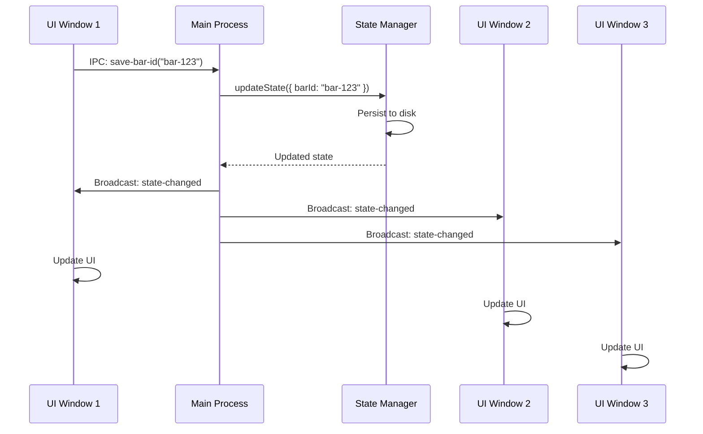
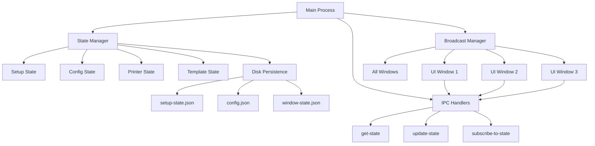

# Design Document: Real-Time State Synchronization

## Overview

Tabeza Connect currently suffers from state synchronization issues where UI screens don't reflect changes made in other windows. This design implements a centralized state management system with real-time broadcast capabilities to ensure all UI screens stay synchronized automatically.

## Main Algorithm/Workflow



## Architecture



## Core Interfaces/Types

```typescript
interface AppState {
  setup: SetupState
  config: ConfigState
  printer: PrinterState
  template: TemplateState
  window: WindowState
}

interface SetupState {
  firstRunComplete: boolean
  steps: {
    barId: StepStatus
    printer: StepStatus
    template: StepStatus
  }
}

interface StepStatus {
  completed: boolean
  completedAt: string | null
}

interface ConfigState {
  barId: string
  apiUrl: string
  watchFolder: string
  httpPort: number
}

interface PrinterState {
  status: 'NotConfigured' | 'PartiallyConfigured' | 'FullyConfigured' | 'Error'
  printerName: string | null
  lastChecked: string | null
}

interface TemplateState {
  exists: boolean
  path: string | null
  version: string | null
  posSystem: string | null
  lastChecked: string | null
}

interface WindowState {
  width: number
  height: number
  x: number | null
  y: number | null
  lastActiveSection: string
}

interface StateChangeEvent {
  type: 'setup' | 'config' | 'printer' | 'template' | 'window'
  data: Partial<AppState>
  timestamp: string
  source: string
}
```

## Key Functions with Formal Specifications

### Function 1: StateManager.updateState()

```typescript
function updateState(
  stateType: 'setup' | 'config' | 'printer' | 'template' | 'window',
  updates: Partial<AppState[stateType]>
): AppState
```

**Preconditions:**
- `stateType` is one of the valid state types
- `updates` object contains valid fields for the specified state type
- State Manager is initialized

**Postconditions:**
- State is updated in memory
- State is persisted to appropriate JSON file
- All registered windows receive `state-changed` broadcast
- Returns complete updated state object
- No data loss occurs during update

**Loop Invariants:** N/A

### Function 2: StateManager.getState()

```typescript
function getState(
  stateType?: 'setup' | 'config' | 'printer' | 'template' | 'window'
): AppState | AppState[stateType]
```

**Preconditions:**
- State Manager is initialized
- If `stateType` provided, it must be valid

**Postconditions:**
- Returns current state from memory (no disk I/O)
- If `stateType` specified, returns only that portion
- If `stateType` omitted, returns complete state
- Never returns null or undefined (returns default state if missing)

**Loop Invariants:** N/A

### Function 3: BroadcastManager.broadcastStateChange()

```typescript
function broadcastStateChange(
  event: StateChangeEvent
): void
```

**Preconditions:**
- `event` contains valid state change information
- At least one window is registered

**Postconditions:**
- All registered windows receive the event via IPC
- Windows that are closed/destroyed are skipped without error
- Event is logged for debugging
- No exceptions thrown if broadcast fails

**Loop Invariants:**
- For each window in registered windows: attempt broadcast, continue on failure

### Function 4: WindowRegistry.registerWindow()

```typescript
function registerWindow(
  windowId: string,
  window: BrowserWindow
): void
```

**Preconditions:**
- `windowId` is unique string identifier
- `window` is valid BrowserWindow instance
- Window is not already registered

**Postconditions:**
- Window is added to registry
- Window receives initial state snapshot
- Window is automatically unregistered on 'closed' event
- Registry size increases by 1

**Loop Invariants:** N/A

## Algorithmic Pseudocode

### Main State Update Algorithm

```pascal
ALGORITHM updateStateAndBroadcast(stateType, updates, source)
INPUT: stateType (string), updates (object), source (string)
OUTPUT: updatedState (object)

BEGIN
  ASSERT stateType IN ['setup', 'config', 'printer', 'template', 'window']
  ASSERT updates IS NOT NULL
  
  // Step 1: Load current state from memory
  currentState ← stateManager.getState(stateType)
  
  // Step 2: Merge updates with current state
  updatedState ← mergeDeep(currentState, updates)
  
  // Step 3: Validate updated state
  IF NOT validateState(stateType, updatedState) THEN
    THROW ValidationError("Invalid state update")
  END IF
  
  // Step 4: Persist to disk
  persistResult ← persistState(stateType, updatedState)
  
  IF NOT persistResult.success THEN
    LOG_ERROR("Failed to persist state: " + persistResult.error)
    THROW PersistenceError(persistResult.error)
  END IF
  
  // Step 5: Update in-memory cache
  stateManager.cache[stateType] ← updatedState
  
  // Step 6: Create state change event
  event ← {
    type: stateType,
    data: updatedState,
    timestamp: getCurrentTimestamp(),
    source: source
  }
  
  // Step 7: Broadcast to all windows
  broadcastManager.broadcastStateChange(event)
  
  // Step 8: Update tray icon if needed
  IF stateType = 'setup' OR stateType = 'printer' THEN
    updateTrayIcon()
  END IF
  
  RETURN updatedState
END
```

**Preconditions:**
- State Manager is initialized
- stateType is valid
- updates object is well-formed

**Postconditions:**
- State is updated in memory and on disk
- All windows are notified
- Tray icon reflects current state
- Returns updated state object

**Loop Invariants:** N/A

### Window Broadcast Algorithm

```pascal
ALGORITHM broadcastToAllWindows(event)
INPUT: event (StateChangeEvent)
OUTPUT: void

BEGIN
  ASSERT event IS NOT NULL
  ASSERT event.type IS VALID
  
  registeredWindows ← windowRegistry.getAllWindows()
  
  LOG_INFO("Broadcasting state change: " + event.type + " to " + LENGTH(registeredWindows) + " windows")
  
  FOR EACH window IN registeredWindows DO
    ASSERT window IS NOT NULL
    
    TRY
      IF window.isDestroyed() THEN
        LOG_WARN("Window destroyed, skipping: " + window.id)
        windowRegistry.unregister(window.id)
        CONTINUE
      END IF
      
      window.webContents.send('state-changed', event)
      LOG_DEBUG("Broadcast sent to window: " + window.id)
      
    CATCH error
      LOG_ERROR("Failed to broadcast to window " + window.id + ": " + error.message)
      // Continue to next window
    END TRY
  END FOR
  
  LOG_INFO("Broadcast complete")
END
```

**Preconditions:**
- event object is valid StateChangeEvent
- windowRegistry is initialized

**Postconditions:**
- All active windows receive the event
- Destroyed windows are removed from registry
- Errors in individual broadcasts don't stop others
- All broadcasts are logged

**Loop Invariants:**
- All previously processed windows have received broadcast or been removed
- Registry remains consistent throughout iteration

### State Synchronization on Window Focus

```pascal
ALGORITHM syncStateOnFocus(window)
INPUT: window (BrowserWindow)
OUTPUT: void

BEGIN
  ASSERT window IS NOT NULL
  ASSERT NOT window.isDestroyed()
  
  LOG_INFO("Window focused, syncing state: " + window.id)
  
  // Get complete current state
  currentState ← stateManager.getState()
  
  // Create sync event
  syncEvent ← {
    type: 'full-sync',
    data: currentState,
    timestamp: getCurrentTimestamp(),
    source: 'focus-handler'
  }
  
  // Send to focused window
  TRY
    window.webContents.send('state-sync', syncEvent)
    LOG_INFO("State sync sent to window: " + window.id)
  CATCH error
    LOG_ERROR("Failed to sync state: " + error.message)
  END TRY
END
```

**Preconditions:**
- window is valid BrowserWindow
- window is not destroyed
- State Manager has current state

**Postconditions:**
- Window receives complete current state
- Window UI reflects latest state
- Errors are logged but don't crash app

**Loop Invariants:** N/A

## Example Usage

```typescript
// Example 1: User saves Bar ID in Setup Mode
// Setup Mode UI calls:
await ipcRenderer.invoke('save-bar-id', 'bar-123')

// Main process handles:
ipcMain.handle('save-bar-id', async (event, barId) => {
  // Update config state
  const updatedConfig = await stateManager.updateState('config', {
    barId: barId
  }, 'setup-window')
  
  // Mark setup step complete
  const updatedSetup = await stateManager.updateState('setup', {
    steps: {
      barId: {
        completed: true,
        completedAt: new Date().toISOString()
      }
    }
  }, 'setup-window')
  
  // Broadcast happens automatically
  // All windows receive 'state-changed' event
  
  return { success: true }
})

// All UI windows listen:
ipcRenderer.on('state-changed', (event, stateChange) => {
  if (stateChange.type === 'config') {
    updateBarIdDisplay(stateChange.data.barId)
  }
  if (stateChange.type === 'setup') {
    updateProgressTracker(stateChange.data.steps)
  }
})

// Example 2: User completes printer setup in wizard
// Printer Wizard calls:
await ipcRenderer.invoke('setup-printer', 'HP LaserJet')

// Main process handles:
ipcMain.handle('setup-printer', async (event, printerName) => {
  // Run printer setup script
  const result = await runPrinterSetup({ printerName })
  
  if (result.success) {
    // Update printer state
    await stateManager.updateState('printer', {
      status: 'FullyConfigured',
      printerName: printerName,
      lastChecked: new Date().toISOString()
    }, 'printer-wizard')
    
    // Mark setup step complete
    await stateManager.updateState('setup', {
      steps: {
        printer: {
          completed: true,
          completedAt: new Date().toISOString()
        }
      }
    }, 'printer-wizard')
  }
  
  return result
})

// Example 3: Window gains focus - sync state
mainWindow.on('focus', () => {
  const currentState = stateManager.getState()
  mainWindow.webContents.send('state-sync', {
    type: 'full-sync',
    data: currentState,
    timestamp: new Date().toISOString(),
    source: 'focus-handler'
  })
})

// Example 4: Handle race condition - multiple windows updating
// Window 1 updates Bar ID
await ipcRenderer.invoke('save-bar-id', 'bar-123')

// Window 2 updates Bar ID (happens simultaneously)
await ipcRenderer.invoke('save-bar-id', 'bar-456')

// State Manager handles sequentially:
// - First update completes, broadcasts to all windows
// - Second update completes, broadcasts to all windows
// - Final state: barId = 'bar-456' (last write wins)
// - All windows show 'bar-456' after both broadcasts
```

## Correctness Properties

### Property 1: State Consistency
```typescript
// Universal quantification: For all windows at any time,
// if no updates are in progress, all windows display the same state
∀ window ∈ RegisteredWindows, ∀ time ∈ Time:
  (NoUpdatesInProgress(time) ⟹ 
    window.displayedState(time) = stateManager.currentState(time))
```

### Property 2: Broadcast Completeness
```typescript
// Universal quantification: For every state update,
// all registered windows receive the broadcast
∀ update ∈ StateUpdates:
  (update.completed ⟹ 
    ∀ window ∈ RegisteredWindows:
      window.receivedBroadcast(update.id))
```

### Property 3: No Data Loss
```typescript
// Universal quantification: For every successful state update,
// the state is persisted to disk before broadcast
∀ update ∈ StateUpdates:
  (update.broadcasted ⟹ update.persisted)
```

### Property 4: Eventually Consistent
```typescript
// Temporal property: After a state update,
// within a bounded time, all windows reflect the new state
∀ update ∈ StateUpdates, ∃ maxDelay ∈ Time:
  (update.completed ⟹ 
    ∀ window ∈ RegisteredWindows:
      window.displayedState(update.timestamp + maxDelay) = update.newState)
```

### Property 5: Focus Sync Guarantee
```typescript
// Universal quantification: When a window gains focus,
// it receives the current state
∀ window ∈ RegisteredWindows, ∀ focusEvent ∈ FocusEvents:
  (window.focused(focusEvent.time) ⟹ 
    window.receivedSync(focusEvent.time) ∧
    window.syncData = stateManager.currentState(focusEvent.time))
```

## Error Handling

### Error Scenario 1: Broadcast Failure to Single Window

**Condition**: One window fails to receive broadcast (destroyed, crashed, IPC error)
**Response**: 
- Log error with window ID
- Remove window from registry if destroyed
- Continue broadcasting to other windows
- Do not throw exception

**Recovery**: 
- Window will sync on next focus event
- No manual intervention required

### Error Scenario 2: State Persistence Failure

**Condition**: Disk write fails (permissions, disk full, file locked)
**Response**:
- Log error with details
- Keep state in memory
- Return error to caller
- Do not broadcast (maintain consistency)

**Recovery**:
- Retry on next update
- User sees error message
- State remains in memory until successful persist

### Error Scenario 3: Invalid State Update

**Condition**: Update contains invalid data (wrong type, missing required fields)
**Response**:
- Validate before applying
- Throw ValidationError
- Do not modify state
- Do not broadcast

**Recovery**:
- Caller receives error
- User sees validation message
- Current state unchanged

### Error Scenario 4: Race Condition - Simultaneous Updates

**Condition**: Two windows update same state field simultaneously
**Response**:
- Queue updates in main process
- Process sequentially
- Last write wins
- Both updates broadcast in order

**Recovery**:
- All windows converge to final state
- No data corruption
- Both operations complete successfully

### Error Scenario 5: Window Registry Corruption

**Condition**: Registry contains destroyed windows or invalid references
**Response**:
- Check window.isDestroyed() before broadcast
- Remove invalid entries automatically
- Log cleanup actions
- Continue with valid windows

**Recovery**:
- Registry self-heals during broadcast
- No manual cleanup needed
- New windows register normally

## Testing Strategy

### Unit Testing Approach

Test each component in isolation:

**State Manager Tests:**
- Test state updates with valid data
- Test state updates with invalid data
- Test state persistence to disk
- Test state loading from disk
- Test cache invalidation
- Test concurrent updates

**Broadcast Manager Tests:**
- Test broadcast to single window
- Test broadcast to multiple windows
- Test broadcast with destroyed window
- Test broadcast with IPC error
- Test window registration/unregistration

**Window Registry Tests:**
- Test window registration
- Test window unregistration
- Test duplicate registration prevention
- Test automatic cleanup on window close

**Coverage Goal**: 90%+ line coverage, 100% branch coverage for critical paths

### Property-Based Testing Approach

Use fast-check to generate random test scenarios:

**Property Test Library**: fast-check

**Property 1: State Consistency**
```typescript
fc.assert(
  fc.property(
    fc.record({
      stateType: fc.constantFrom('setup', 'config', 'printer', 'template'),
      updates: fc.object(),
      numWindows: fc.integer({ min: 1, max: 10 })
    }),
    async ({ stateType, updates, numWindows }) => {
      // Create N windows
      const windows = createTestWindows(numWindows)
      
      // Update state
      await stateManager.updateState(stateType, updates, 'test')
      
      // Wait for broadcasts
      await delay(100)
      
      // All windows should have same state
      const states = windows.map(w => w.getDisplayedState())
      return states.every(s => deepEqual(s, states[0]))
    }
  )
)
```

**Property 2: No Data Loss**
```typescript
fc.assert(
  fc.property(
    fc.array(fc.record({
      stateType: fc.constantFrom('setup', 'config'),
      updates: fc.object()
    }), { minLength: 1, maxLength: 20 }),
    async (updates) => {
      // Apply all updates
      for (const update of updates) {
        await stateManager.updateState(update.stateType, update.updates, 'test')
      }
      
      // Reload from disk
      const diskState = await loadStateFromDisk()
      const memoryState = stateManager.getState()
      
      // Memory and disk should match
      return deepEqual(diskState, memoryState)
    }
  )
)
```

### Integration Testing Approach

Test complete workflows end-to-end:

**Test 1: Complete Setup Flow**
1. Start app in first-run state
2. Open Setup Mode window
3. Save Bar ID
4. Verify Normal Mode dashboard shows Bar ID
5. Complete printer setup
6. Verify Setup Mode shows printer complete
7. Generate template
8. Verify all windows show setup complete

**Test 2: Multi-Window Sync**
1. Open Normal Mode window
2. Open Printer Wizard window
3. Open Template Generator window
4. Update config in Normal Mode
5. Verify Printer Wizard reflects change
6. Verify Template Generator reflects change

**Test 3: Focus Sync Recovery**
1. Open window A
2. Minimize window A
3. Update state from window B
4. Focus window A
5. Verify window A shows updated state

## Performance Considerations

### Optimization 1: In-Memory State Cache
- Keep complete state in memory
- Avoid disk reads on every get
- Only read from disk on app startup
- Cache invalidation on updates

**Expected Impact**: 100x faster state reads (0.01ms vs 1ms)

### Optimization 2: Debounced Broadcasts
- Batch multiple rapid updates
- Broadcast once after 50ms quiet period
- Reduces IPC overhead
- Prevents UI thrashing

**Expected Impact**: 10x fewer IPC calls during rapid updates

### Optimization 3: Selective State Updates
- Only broadcast changed portions
- Include diff in broadcast event
- UI updates only affected components
- Reduces re-render overhead

**Expected Impact**: 50% faster UI updates

### Optimization 4: Lazy Window Registration
- Register windows only when created
- Unregister immediately on close
- No polling or heartbeat needed
- Minimal memory overhead

**Expected Impact**: Constant O(1) memory per window

### Performance Targets
- State update latency: < 10ms (persist + broadcast)
- Broadcast to all windows: < 50ms for 5 windows
- Memory overhead: < 1MB for state cache
- Disk I/O: < 5ms per persist operation

## Security Considerations

### Consideration 1: State Validation
- Validate all state updates before applying
- Prevent injection of malicious data
- Sanitize user input (Bar ID, printer names)
- Type checking on all state fields

**Mitigation**: Strict TypeScript types + runtime validation

### Consideration 2: File System Security
- State files stored in app.getPath('userData')
- Windows user permissions apply
- No world-readable files
- Atomic writes to prevent corruption

**Mitigation**: Use fs.writeFileSync with proper permissions

### Consideration 3: IPC Security
- contextIsolation: true in all windows
- Preload script for IPC exposure
- No direct nodeIntegration
- Validate all IPC messages

**Mitigation**: Follow Electron security best practices

## Dependencies

### Internal Dependencies
- `electron` - IPC and window management
- `fs` - File system operations for persistence
- `path` - Path resolution for state files

### External Dependencies
None - uses only Node.js built-ins and Electron APIs

### File Dependencies
- `setup-state.json` - Setup completion state
- `config.json` - Application configuration
- `window-state.json` - Window dimensions and position

### Module Dependencies
- `setup-state-manager.js` - Existing setup state management
- `window-state-manager.js` - Existing window state management
- `electron-main.js` - Main process entry point
