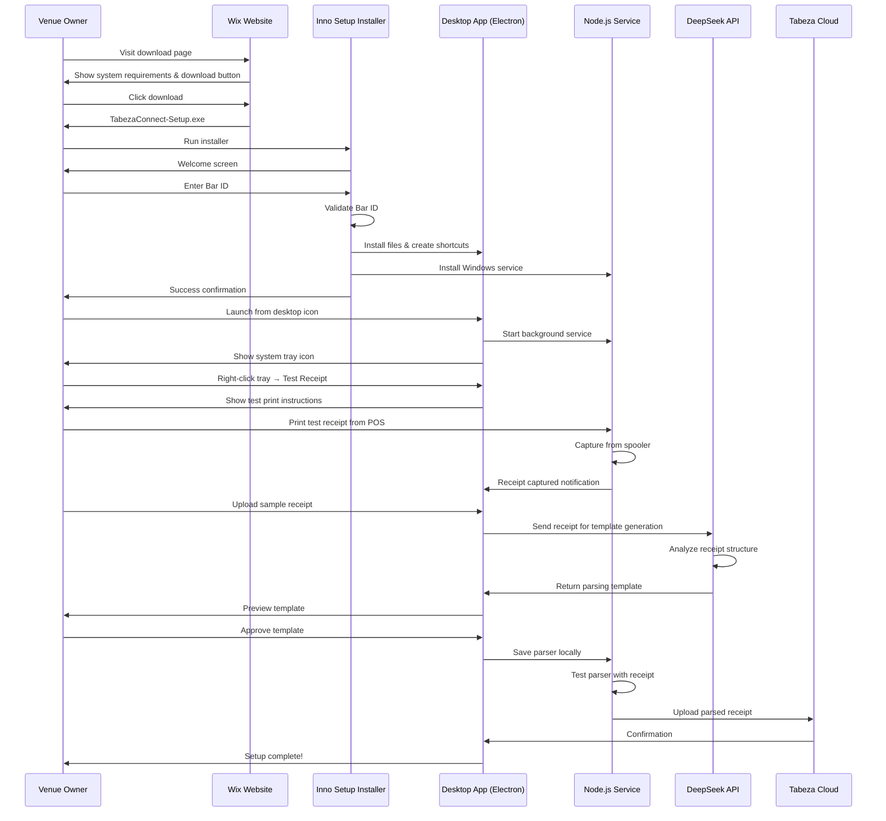
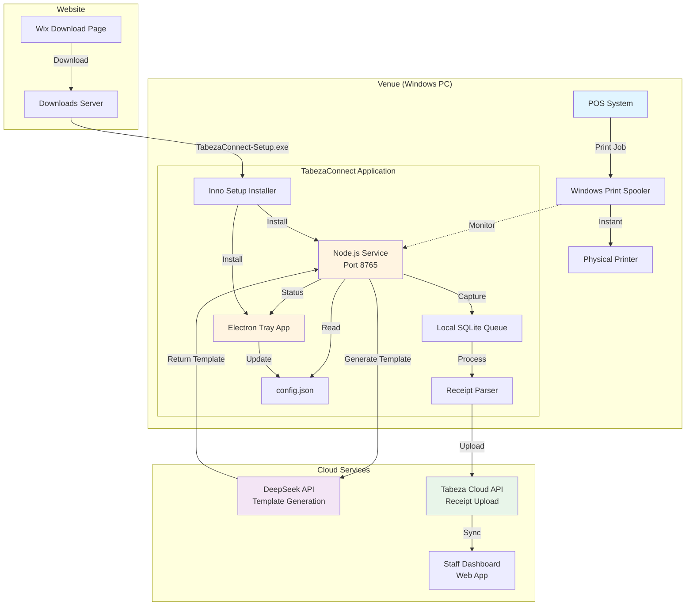
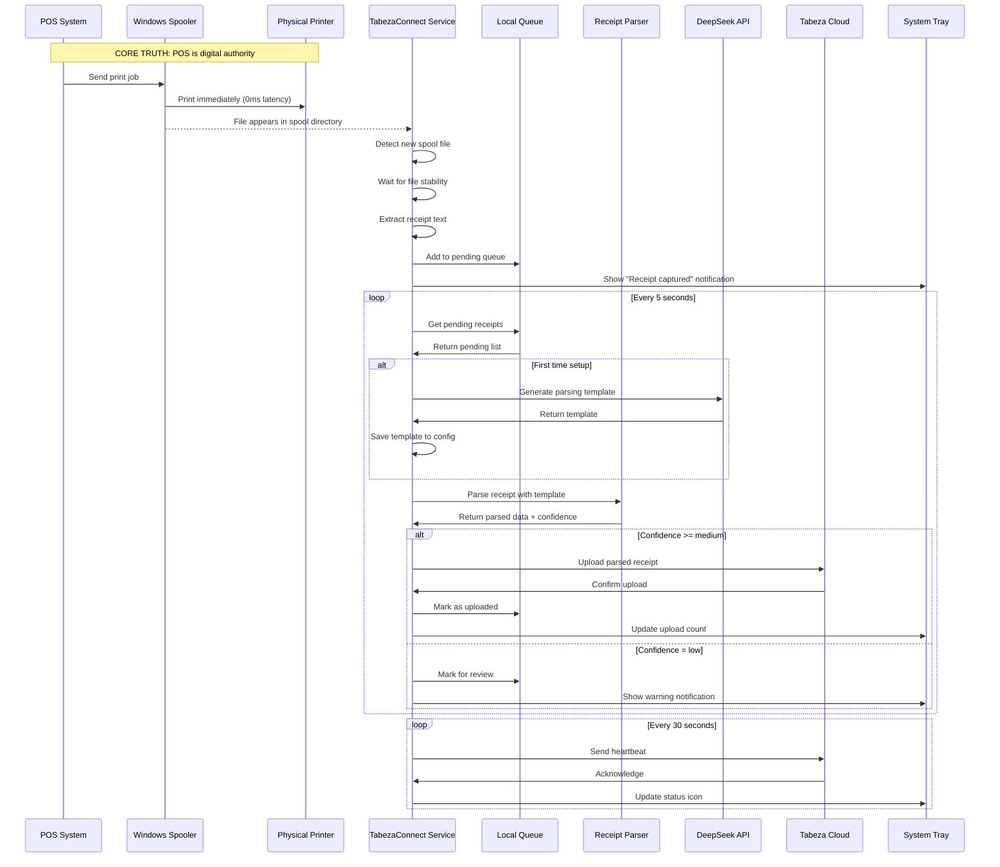
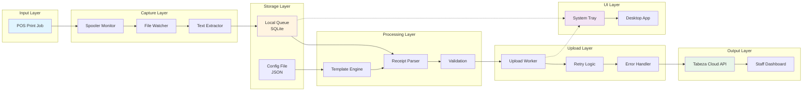

# Design Document: TabezaConnect Customer Onboarding Experience

## Overview

TabezaConnect is a Windows desktop application that bridges POS systems to Tabeza by capturing receipt data from the print spooler. This design covers the complete customer onboarding experience from download through ongoing management, ensuring non-technical users can successfully install, configure, and operate the system.

The onboarding experience consists of seven key phases: Download, Installation, System Tray Setup, Receipt Testing, Template Generation, Parser Approval, and Ongoing Management. Each phase is designed with clear visual feedback, error handling, and recovery mechanisms to ensure a smooth user experience.

## Main Algorithm/Workflow



## Core Interfaces/Types

```typescript
// Configuration Types
interface TabezaConnectConfig {
  barId: string;
  apiUrl: string;
  driverId: string;
  watchFolder: string;
  installedAt: string;
  autoStart: boolean;
  notificationShown: boolean;
  parsingTemplate?: ParsingTemplate;
  templateVersion?: string;
  templateApprovedAt?: string;
}

interface ParsingTemplate {
  receiptNumber: string;
  timestamp: string;
  items: ItemsConfig;
  subtotal: string;
  tax: string;
  total: string;
}

interface ItemsConfig {
  pattern: string;
  multiline: boolean;
  startMarker: string;
  endMarker: string;
}

// Receipt Types
interface CapturedReceipt {
  id: string;
  rawText: string;
  capturedAt: string;
  printerName: string;
  fileSize: number;
  status: 'pending' | 'parsed' | 'uploaded' | 'failed';
}

interface ParsedReceipt {
  receiptNumber: string;
  timestamp: string;
  items: ReceiptItem[];
  subtotal: number;
  tax: number;
  total: number;
  confidence: 'high' | 'medium' | 'low';
  rawText: string;
}

interface ReceiptItem {
  name: string;
  quantity: number;
  price: number;
}

// UI State Types
interface OnboardingState {
  currentStep: 'download' | 'install' | 'configure' | 'test' | 'template' | 'approve' | 'complete';
  barId?: string;
  testReceiptCaptured: boolean;
  templateGenerated: boolean;
  templateApproved: boolean;
  errors: string[];
}

interface TrayIconState {
  status: 'online' | 'offline' | 'processing' | 'error';
  lastHeartbeat?: string;
  queuedReceipts: number;
  uploadedToday: number;
}

// API Types
interface TemplateGenerationRequest {
  receiptText: string;
  barId: string;
  posSystemName?: string;
}

interface TemplateGenerationResponse {
  template: ParsingTemplate;
  confidence: number;
  suggestedFields: string[];
  warnings: string[];
}

interface TemplateApprovalRequest {
  template: ParsingTemplate;
  testReceipts: string[];
  barId: string;
}

interface TemplateApprovalResponse {
  approved: boolean;
  testResults: ParsedReceipt[];
  issues: string[];
}
```


## Key Functions with Formal Specifications

### Function 1: validateBarId()

```typescript
function validateBarId(barId: string): ValidationResult
```

**Preconditions:**
- `barId` is a non-null string
- User has access to Tabeza staff dashboard to retrieve Bar ID

**Postconditions:**
- Returns `{ valid: true }` if Bar ID exists in database and venue is in Basic mode
- Returns `{ valid: false, error: string }` if Bar ID is invalid or venue not configured for Basic mode
- No side effects on database

**Loop Invariants:** N/A

### Function 2: captureReceiptFromSpooler()

```typescript
function captureReceiptFromSpooler(spoolFile: string): CapturedReceipt
```

**Preconditions:**
- `spoolFile` exists in Windows spooler directory
- File is readable by service account
- Service has permissions to access `C:\Windows\System32\spool\PRINTERS`

**Postconditions:**
- Returns valid `CapturedReceipt` object with raw text extracted
- Original spool file remains unchanged
- Receipt added to local queue if extraction successful
- If extraction fails, returns receipt with `status: 'failed'` and error logged

**Loop Invariants:** N/A

### Function 3: generateParsingTemplate()

```typescript
async function generateParsingTemplate(receiptText: string): Promise<ParsingTemplate>
```

**Preconditions:**
- `receiptText` is non-empty string
- DeepSeek API key is configured
- Network connectivity available

**Postconditions:**
- Returns valid `ParsingTemplate` with regex patterns for all fields
- Template includes at minimum: `total` field (required)
- Template validated before return (all regex patterns compile)
- If API fails, returns default template with confidence warning

**Loop Invariants:** N/A

### Function 4: testParsingTemplate()

```typescript
function testParsingTemplate(template: ParsingTemplate, receipts: string[]): TestResult[]
```

**Preconditions:**
- `template` is valid ParsingTemplate object
- `receipts` is non-empty array of receipt text strings
- All regex patterns in template are valid

**Postconditions:**
- Returns array of test results, one per receipt
- Each result includes: parsed data, confidence level, field extraction success
- No modifications to template or receipts
- All receipts processed even if some fail

**Loop Invariants:**
- For each iteration: all previously processed receipts have valid test results
- Template remains unchanged throughout iteration

### Function 5: uploadParsedReceipt()

```typescript
async function uploadParsedReceipt(receipt: ParsedReceipt): Promise<UploadResult>
```

**Preconditions:**
- `receipt` has valid parsed data with confidence >= 'medium'
- Network connectivity available
- Bar ID configured and valid
- Tabeza API endpoint accessible

**Postconditions:**
- Returns `{ success: true, receiptId: string }` if upload successful
- Receipt marked as 'uploaded' in local queue
- If upload fails, receipt remains in queue for retry
- Retry count incremented on failure
- Maximum 3 retry attempts before marking as 'failed'

**Loop Invariants:** N/A


## Algorithmic Pseudocode

### Main Onboarding Algorithm

```pascal
ALGORITHM completeOnboarding(userInput)
INPUT: userInput containing barId, printerSelection
OUTPUT: onboardingResult with status and configuration

BEGIN
  ASSERT userInput.barId IS NOT NULL
  ASSERT userInput.barId.length >= 5
  
  // Step 1: Validate Bar ID with cloud
  validationResult ← validateBarIdWithCloud(userInput.barId)
  IF validationResult.valid = FALSE THEN
    RETURN {success: false, error: validationResult.error}
  END IF
  
  // Step 2: Create configuration
  config ← {
    barId: userInput.barId,
    apiUrl: "https://tabeza.co.ke",
    driverId: generateDriverId(),
    watchFolder: getDefaultWatchFolder(),
    installedAt: getCurrentTimestamp(),
    autoStart: true,
    venueMode: "basic",  // CORE TRUTH: Basic mode = POS authority only
    authorityMode: "pos"  // CORE TRUTH: POS is digital authority
  }
  
  // Step 3: Install Windows service
  serviceResult ← installWindowsService(config)
  IF serviceResult.success = FALSE THEN
    RETURN {success: false, error: "Service installation failed"}
  END IF
  
  // Step 4: Create system tray application
  trayResult ← createSystemTray(config)
  
  // Step 5: Create desktop shortcut
  createDesktopShortcut()
  
  // Step 6: Start background service
  startPrinterService(config)
  
  ASSERT config.barId IS NOT NULL
  ASSERT serviceResult.success = TRUE
  
  RETURN {
    success: true,
    config: config,
    nextStep: "testReceipt"
  }
END
```

**Preconditions:**
- Windows 10/11 operating system
- Administrator privileges for installer
- Valid Bar ID from Tabeza dashboard
- Internet connectivity for validation

**Postconditions:**
- Configuration file created at `%APPDATA%\Tabeza\config.json`
- Windows service installed and running
- System tray icon visible
- Desktop shortcut created
- Service sending heartbeats to cloud

**Loop Invariants:** N/A

### Receipt Capture Algorithm

```pascal
ALGORITHM captureReceiptFromSpooler()
INPUT: none (monitors spooler continuously)
OUTPUT: stream of CapturedReceipt objects

BEGIN
  spoolerPath ← "C:\Windows\System32\spool\PRINTERS"
  watchedFiles ← new Set()
  
  WHILE service is running DO
    ASSERT spoolerPath exists AND is readable
    
    // Get current spool files
    currentFiles ← listFiles(spoolerPath)
    
    FOR EACH file IN currentFiles DO
      ASSERT file.extension IN [".spl", ".shd"]
      
      // Check if this is a new file
      IF file NOT IN watchedFiles THEN
        // Wait for file to be fully written
        WAIT_UNTIL fileIsStable(file)
        
        // Extract receipt text
        receiptText ← extractTextFromSpoolFile(file)
        
        IF receiptText IS NOT NULL AND receiptText.length > 0 THEN
          // Create receipt object
          receipt ← {
            id: generateReceiptId(),
            rawText: receiptText,
            capturedAt: getCurrentTimestamp(),
            printerName: extractPrinterName(file),
            fileSize: file.size,
            status: "pending"
          }
          
          // Add to local queue
          addToQueue(receipt)
          
          // Notify user via tray icon
          showTrayNotification("Receipt captured")
          
          // Mark as watched
          watchedFiles.add(file)
        END IF
      END IF
    END FOR
    
    // Clean up old watched files
    FOR EACH watchedFile IN watchedFiles DO
      IF watchedFile NOT IN currentFiles THEN
        watchedFiles.remove(watchedFile)
      END IF
    END FOR
    
    // Wait before next scan
    SLEEP(2000)  // 2 seconds
  END WHILE
END
```

**Preconditions:**
- Windows spooler service is running
- Service has read permissions on spooler directory
- Local queue directory exists and is writable

**Postconditions:**
- All new spool files are detected and processed
- Receipt text extracted and queued
- User notified of captures
- No spool files are missed or duplicated

**Loop Invariants:**
- All files in `watchedFiles` have been processed
- All receipts in queue have unique IDs
- Service remains responsive throughout monitoring


### Template Generation Algorithm

```pascal
ALGORITHM generateParsingTemplate(receiptText)
INPUT: receiptText (raw receipt string from POS)
OUTPUT: ParsingTemplate object with regex patterns

BEGIN
  ASSERT receiptText IS NOT NULL
  ASSERT receiptText.length > 0
  
  // Step 1: Send to DeepSeek API for analysis
  apiRequest ← {
    model: "deepseek-chat",
    messages: [
      {
        role: "system",
        content: "You are a receipt parsing expert. Analyze the receipt and generate regex patterns."
      },
      {
        role: "user",
        content: "Generate parsing template for: " + receiptText
      }
    ]
  }
  
  TRY
    apiResponse ← callDeepSeekAPI(apiRequest)
    
    // Step 2: Extract template from response
    template ← parseTemplateFromResponse(apiResponse)
    
    // Step 3: Validate all regex patterns
    FOR EACH field IN template DO
      IF field.pattern IS NOT NULL THEN
        TRY
          testRegex ← new RegExp(field.pattern)
        CATCH regexError
          // Replace invalid pattern with default
          field.pattern ← getDefaultPattern(field.name)
          logWarning("Invalid pattern for " + field.name)
        END TRY
      END IF
    END FOR
    
    // Step 4: Ensure required fields exist
    IF template.total IS NULL THEN
      template.total ← DEFAULT_TOTAL_PATTERN
    END IF
    
    // Step 5: Test template against original receipt
    testResult ← testParsingTemplate(template, [receiptText])
    
    IF testResult[0].confidence = "low" THEN
      logWarning("Generated template has low confidence")
      template.warnings ← ["Low confidence - manual review recommended"]
    END IF
    
    ASSERT template.total IS NOT NULL
    ASSERT validatePattern(template.total) = TRUE
    
    RETURN template
    
  CATCH apiError
    // Fallback to default template
    logError("API call failed: " + apiError.message)
    RETURN DEFAULT_TEMPLATE
  END TRY
END
```

**Preconditions:**
- `receiptText` contains valid receipt data
- DeepSeek API key is configured
- Network connectivity available
- API rate limits not exceeded

**Postconditions:**
- Returns valid ParsingTemplate with all patterns validated
- Template includes at minimum the required `total` field
- If API fails, returns default template
- All regex patterns compile without errors
- Template tested against input receipt

**Loop Invariants:**
- For each field iteration: all previously validated patterns remain valid
- Template structure remains consistent throughout validation

### Upload Worker Algorithm

```pascal
ALGORITHM processUploadQueue()
INPUT: none (processes local queue continuously)
OUTPUT: stream of upload results

BEGIN
  queuePath ← getQueuePath()
  retryDelay ← 5000  // 5 seconds
  maxRetries ← 3
  
  WHILE service is running DO
    ASSERT queuePath exists AND is writable
    
    // Get pending receipts from queue
    pendingReceipts ← loadPendingReceipts(queuePath)
    
    FOR EACH receipt IN pendingReceipts DO
      ASSERT receipt.status IN ["pending", "failed"]
      ASSERT receipt.retryCount <= maxRetries
      
      // Parse receipt if not already parsed
      IF receipt.parsedData IS NULL THEN
        template ← loadParsingTemplate()
        receipt.parsedData ← parseReceipt(receipt.rawText, template)
      END IF
      
      // Only upload if confidence is acceptable
      IF receipt.parsedData.confidence IN ["high", "medium"] THEN
        TRY
          // Attempt upload to cloud
          uploadResult ← uploadToCloud(receipt)
          
          IF uploadResult.success = TRUE THEN
            // Mark as uploaded
            receipt.status ← "uploaded"
            receipt.uploadedAt ← getCurrentTimestamp()
            receipt.cloudReceiptId ← uploadResult.receiptId
            
            // Move to completed folder
            moveToCompleted(receipt)
            
            // Update tray icon stats
            incrementUploadCount()
            
            logInfo("Receipt uploaded: " + receipt.id)
          ELSE
            // Upload failed, increment retry count
            receipt.retryCount ← receipt.retryCount + 1
            
            IF receipt.retryCount >= maxRetries THEN
              receipt.status ← "failed"
              moveToFailed(receipt)
              logError("Receipt failed after max retries: " + receipt.id)
            ELSE
              receipt.status ← "pending"
              saveReceipt(receipt)
              logWarning("Upload failed, will retry: " + receipt.id)
            END IF
          END IF
          
        CATCH uploadError
          receipt.retryCount ← receipt.retryCount + 1
          receipt.lastError ← uploadError.message
          saveReceipt(receipt)
          logError("Upload error: " + uploadError.message)
        END TRY
      ELSE
        // Low confidence - move to review folder
        receipt.status ← "needs_review"
        moveToReview(receipt)
        logWarning("Low confidence receipt needs review: " + receipt.id)
      END IF
    END FOR
    
    // Wait before next processing cycle
    SLEEP(retryDelay)
  END WHILE
END
```

**Preconditions:**
- Local queue directory exists and is accessible
- Parsing template is loaded and valid
- Network connectivity available for uploads
- Tabeza API endpoint is accessible

**Postconditions:**
- All pending receipts are processed
- Successful uploads moved to completed folder
- Failed receipts moved to failed folder after max retries
- Low confidence receipts moved to review folder
- Queue remains consistent and no receipts lost

**Loop Invariants:**
- All receipts in queue have valid status
- Retry count never exceeds maxRetries
- No receipt is processed twice in same cycle
- Queue directory structure remains valid


## Example Usage

```typescript
// Example 1: Complete onboarding flow
const onboarding = new OnboardingManager();

// User downloads and runs installer
const installerResult = await onboarding.runInstaller({
  barId: "438c80c1-fe11-4ac5-8a48-2fc45104ba31",
  installPath: "C:\\Program Files\\TabezaConnect"
});

if (installerResult.success) {
  console.log("Installation complete!");
  console.log("Service running:", installerResult.serviceStatus);
  console.log("Tray icon visible:", installerResult.trayIconCreated);
}

// Example 2: Test receipt capture
const testManager = new TestReceiptManager();

// User prints test receipt from POS
console.log("Please print a test receipt from your POS system...");

// Wait for receipt capture
const capturedReceipt = await testManager.waitForReceipt({
  timeout: 60000  // 60 seconds
});

if (capturedReceipt) {
  console.log("Receipt captured!");
  console.log("Raw text length:", capturedReceipt.rawText.length);
  console.log("Printer:", capturedReceipt.printerName);
}

// Example 3: Generate parsing template
const templateGenerator = new TemplateGenerator({
  apiKey: process.env.DEEPSEEK_API_KEY
});

const template = await templateGenerator.generate(capturedReceipt.rawText);

console.log("Template generated!");
console.log("Confidence:", template.confidence);
console.log("Fields detected:", Object.keys(template));

// Example 4: Test template with multiple receipts
const testReceipts = [
  capturedReceipt.rawText,
  // ... more test receipts
];

const testResults = await templateGenerator.test(template, testReceipts);

console.log("Test results:");
testResults.forEach((result, index) => {
  console.log(`Receipt ${index + 1}:`);
  console.log(`  Confidence: ${result.confidence}`);
  console.log(`  Total extracted: ${result.parsedData.total}`);
  console.log(`  Items found: ${result.parsedData.items.length}`);
});

// Example 5: Approve and save template
if (testResults.every(r => r.confidence !== 'low')) {
  await templateGenerator.approve(template);
  console.log("Template approved and saved!");
  
  // Restart service to apply new template
  await onboarding.restartService();
}

// Example 6: Monitor ongoing operations
const monitor = new ServiceMonitor();

monitor.on('receipt-captured', (receipt) => {
  console.log("New receipt captured:", receipt.id);
});

monitor.on('receipt-uploaded', (receipt) => {
  console.log("Receipt uploaded:", receipt.cloudReceiptId);
});

monitor.on('upload-failed', (receipt, error) => {
  console.error("Upload failed:", receipt.id, error);
});

monitor.on('heartbeat-sent', (status) => {
  console.log("Service online, queue size:", status.queuedReceipts);
});

// Example 7: Access from system tray
// User right-clicks tray icon and selects "View Captured Receipts"
const trayApp = new TrayApplication();

trayApp.showReceiptHistory({
  filter: 'today',
  limit: 50
});

// Example 8: Modify parser template
const configManager = new ConfigurationManager();

// Load current template
const currentTemplate = await configManager.loadTemplate();

// User edits a pattern
currentTemplate.items.pattern = "^(\\d+)\\s+(.+?)\\s{2,}(\\d+\\.\\d{2})$";

// Validate changes
const validation = await configManager.validateTemplate(currentTemplate);

if (validation.valid) {
  await configManager.saveTemplate(currentTemplate);
  console.log("Template updated successfully!");
} else {
  console.error("Invalid template:", validation.errors);
}
```


## Architecture

### System Architecture Diagram



### Component Interaction Flow



### Data Flow Architecture




## Components and Interfaces

### Component 1: Wix Download Page

**Purpose**: Provide professional download experience with clear instructions and system requirements

**Interface**:
```typescript
interface DownloadPageProps {
  version: string;
  downloadUrl: string;
  systemRequirements: SystemRequirements;
  releaseNotes: string[];
}

interface SystemRequirements {
  os: string[];  // ["Windows 10", "Windows 11"]
  ram: string;   // "4GB minimum"
  disk: string;  // "100MB free space"
  network: string;  // "Internet connection required"
  permissions: string;  // "Administrator access required"
}
```

**Responsibilities**:
- Display current version and release notes
- Show system requirements clearly
- Provide download button with file size
- Include installation instructions
- Link to support documentation
- Track download analytics

**UI Elements**:
- Hero section with Tabeza branding
- Prominent download button
- System requirements checklist
- Installation steps accordion
- FAQ section
- Support contact information

### Component 2: Inno Setup Installer

**Purpose**: Professional Windows installer that guides user through setup process

**Interface**:
```typescript
interface InstallerConfig {
  appName: string;
  version: string;
  publisher: string;
  installDir: string;
  requireAdmin: boolean;
  createDesktopIcon: boolean;
  createStartMenuIcon: boolean;
  autoStart: boolean;
}

interface InstallationSteps {
  welcome: WelcomeScreen;
  barIdInput: BarIdInputScreen;
  printerConfig: PrinterConfigScreen;
  installation: InstallationProgressScreen;
  completion: CompletionScreen;
}
```

**Responsibilities**:
- Validate administrator privileges
- Collect Bar ID from user
- Validate Bar ID with cloud
- Install application files
- Install Windows service
- Create shortcuts (desktop, start menu)
- Configure auto-start
- Show installation progress
- Handle installation errors
- Provide rollback on failure

**Installation Flow**:
1. Welcome screen with Tabeza branding
2. License agreement (if applicable)
3. Bar ID input with validation
4. Installation directory selection
5. Installation progress with detailed steps
6. Service installation and startup
7. Completion screen with next steps

### Component 3: Node.js Background Service

**Purpose**: Core service that monitors print spooler and processes receipts

**Interface**:
```typescript
interface PrinterService {
  start(): Promise<void>;
  stop(): Promise<void>;
  restart(): Promise<void>;
  getStatus(): ServiceStatus;
  getConfig(): TabezaConnectConfig;
  updateConfig(config: Partial<TabezaConnectConfig>): Promise<void>;
}

interface ServiceStatus {
  running: boolean;
  uptime: number;
  lastHeartbeat: string;
  queueSize: number;
  uploadedToday: number;
  errors: ServiceError[];
}

interface ServiceError {
  timestamp: string;
  type: 'capture' | 'parse' | 'upload' | 'network';
  message: string;
  receipt?: string;
}
```

**Responsibilities**:
- Monitor Windows print spooler directory
- Detect new spool files
- Extract receipt text from spool files
- Add receipts to local queue
- Parse receipts using configured template
- Upload parsed receipts to cloud
- Retry failed uploads
- Send heartbeat to cloud every 30 seconds
- Log all operations
- Handle errors gracefully
- Provide HTTP API for status checks

**API Endpoints**:
- `GET /status` - Service health and statistics
- `GET /config` - Current configuration
- `POST /config` - Update configuration
- `GET /queue` - View queued receipts
- `GET /receipts/recent` - Recent captures
- `POST /test-capture` - Trigger test capture
- `POST /restart` - Restart service

### Component 4: Electron System Tray Application

**Purpose**: Always-visible UI for monitoring and managing TabezaConnect

**Interface**:
```typescript
interface TrayApplication {
  show(): void;
  hide(): void;
  updateStatus(status: TrayIconState): void;
  showNotification(message: string, type: 'info' | 'warning' | 'error'): void;
  openMenu(): void;
}

interface TrayMenu {
  items: TrayMenuItem[];
}

interface TrayMenuItem {
  label: string;
  enabled: boolean;
  click?: () => void;
  submenu?: TrayMenuItem[];
  separator?: boolean;
}
```

**Responsibilities**:
- Display status icon in system tray
- Show connection status (online/offline/processing)
- Display notification balloons for events
- Provide context menu for actions
- Open configuration window
- Open receipt history window
- Restart service
- View logs
- Access staff dashboard
- Show about information
- Exit application

**Tray Icon States**:
- Green: Online and processing normally
- Yellow: Processing with warnings
- Red: Offline or error state
- Gray: Service stopped
- Animated: Currently uploading

**Context Menu Items**:
- TabezaConnect (header, disabled)
- Bar: [Bar ID] (info, disabled)
- Status: [Online/Offline] (info, disabled)
- ---
- Test Receipt Capture
- View Captured Receipts
- Open Configuration
- ---
- Open Staff Dashboard
- View Logs
- Restart Service
- ---
- About TabezaConnect
- Exit

### Component 5: Receipt Parser Module

**Purpose**: Extract structured data from receipt text using regex templates

**Interface**:
```typescript
interface ReceiptParser {
  parse(receiptText: string, template?: ParsingTemplate): ParsedReceipt;
  format(parsedData: ParsedReceipt): string;
  validate(template: ParsingTemplate): ValidationResult;
  test(template: ParsingTemplate, receipts: string[]): TestResult[];
}

interface ValidationResult {
  valid: boolean;
  errors: string[];
  warnings: string[];
}

interface TestResult {
  receiptIndex: number;
  parsed: ParsedReceipt;
  success: boolean;
  issues: string[];
}
```

**Responsibilities**:
- Parse receipt text using regex patterns
- Extract: receipt number, timestamp, items, subtotal, tax, total
- Determine confidence level (high/medium/low)
- Validate parsing templates
- Test templates against sample receipts
- Format parsed data back to text
- Handle parsing errors gracefully
- Never reject any input (always return result)
- Log parsing issues for debugging

**Confidence Levels**:
- High: All major fields extracted successfully
- Medium: Partial extraction (items + total OR total + metadata)
- Low: Minimal extraction or parsing failure

### Component 6: Template Generator (DeepSeek Integration)

**Purpose**: Generate parsing templates using AI analysis of receipt structure

**Interface**:
```typescript
interface TemplateGenerator {
  generate(receiptText: string): Promise<ParsingTemplate>;
  test(template: ParsingTemplate, receipts: string[]): Promise<TestResult[]>;
  approve(template: ParsingTemplate): Promise<void>;
  getDefaultTemplate(): ParsingTemplate;
}

interface DeepSeekRequest {
  model: string;
  messages: ChatMessage[];
  temperature: number;
  max_tokens: number;
}

interface ChatMessage {
  role: 'system' | 'user' | 'assistant';
  content: string;
}
```

**Responsibilities**:
- Send receipt text to DeepSeek API
- Parse AI response into template structure
- Validate generated regex patterns
- Test template against original receipt
- Provide confidence score
- Handle API failures gracefully
- Fall back to default template on error
- Cache generated templates
- Version templates for rollback

**AI Prompt Strategy**:
```
System: You are a receipt parsing expert. Analyze receipt formats and generate regex patterns.

User: Generate a parsing template for this receipt:
[receipt text]

Expected output format:
{
  "receiptNumber": "regex pattern",
  "timestamp": "regex pattern",
  "items": {
    "pattern": "regex with 3 capture groups",
    "startMarker": "regex",
    "endMarker": "regex"
  },
  "subtotal": "regex pattern",
  "tax": "regex pattern",
  "total": "regex pattern"
}
```


### Component 7: Local Queue Manager

**Purpose**: Manage offline-first receipt queue with retry logic

**Interface**:
```typescript
interface QueueManager {
  add(receipt: CapturedReceipt): Promise<void>;
  getPending(): Promise<CapturedReceipt[]>;
  markUploaded(receiptId: string, cloudId: string): Promise<void>;
  markFailed(receiptId: string, error: string): Promise<void>;
  moveToReview(receiptId: string): Promise<void>;
  getStatistics(): QueueStatistics;
}

interface QueueStatistics {
  pending: number;
  uploaded: number;
  failed: number;
  needsReview: number;
  totalSize: number;
}
```

**Responsibilities**:
- Store receipts in SQLite database
- Maintain queue status (pending/uploaded/failed/review)
- Track retry attempts
- Provide queue statistics
- Clean up old uploaded receipts
- Export receipts for debugging
- Handle database errors
- Ensure no receipt loss

**Queue Structure**:
```
C:\ProgramData\Tabeza\
├── queue\
│   ├── queue.db (SQLite database)
│   ├── pending\
│   ├── uploaded\
│   ├── failed\
│   └── review\
└── logs\
    ├── service.log
    ├── upload.log
    └── errors.log
```

### Component 8: Configuration Manager

**Purpose**: Manage application configuration and parsing templates

**Interface**:
```typescript
interface ConfigurationManager {
  load(): Promise<TabezaConnectConfig>;
  save(config: TabezaConnectConfig): Promise<void>;
  loadTemplate(): Promise<ParsingTemplate>;
  saveTemplate(template: ParsingTemplate): Promise<void>;
  validateConfig(config: TabezaConnectConfig): ValidationResult;
  backup(): Promise<string>;
  restore(backupPath: string): Promise<void>;
}
```

**Responsibilities**:
- Load configuration from JSON file
- Save configuration changes
- Validate configuration structure
- Manage parsing templates
- Version templates for rollback
- Backup and restore configuration
- Encrypt sensitive data (API keys)
- Provide default configuration

**Configuration File Location**:
- Development: `%APPDATA%\Tabeza\config.json`
- Production: `C:\ProgramData\Tabeza\config.json`

## Data Models

### Model 1: TabezaConnectConfig

```typescript
interface TabezaConnectConfig {
  // Required fields
  barId: string;
  apiUrl: string;
  driverId: string;
  
  // Paths
  watchFolder: string;
  queuePath: string;
  logPath: string;
  
  // Service settings
  autoStart: boolean;
  uploadRetryDelay: number;
  maxRetries: number;
  heartbeatInterval: number;
  
  // Installation metadata
  installedAt: string;
  version: string;
  
  // Venue configuration (CORE TRUTH)
  venueMode: 'basic';  // Always 'basic' for TabezaConnect
  authorityMode: 'pos';  // Always 'pos' - POS is digital authority
  
  // Parsing configuration
  parsingTemplate?: ParsingTemplate;
  templateVersion?: string;
  templateApprovedAt?: string;
  
  // UI settings
  notificationShown: boolean;
  trayIconEnabled: boolean;
  
  // Feature flags
  enableAutoTemplateGeneration: boolean;
  enableLowConfidenceUpload: boolean;
}
```

**Validation Rules**:
- `barId`: Must be valid UUID format, must exist in Tabeza database
- `apiUrl`: Must be valid HTTPS URL
- `driverId`: Must be unique per installation
- `watchFolder`: Must be valid Windows path
- `venueMode`: Must be 'basic' (enforced by CORE TRUTH)
- `authorityMode`: Must be 'pos' (enforced by CORE TRUTH)
- `uploadRetryDelay`: Must be >= 1000ms
- `maxRetries`: Must be >= 1 and <= 10
- `heartbeatInterval`: Must be >= 10000ms (10 seconds)

### Model 2: CapturedReceipt

```typescript
interface CapturedReceipt {
  // Identity
  id: string;  // UUID
  barId: string;
  driverId: string;
  
  // Capture metadata
  capturedAt: string;  // ISO 8601 timestamp
  printerName: string;
  spoolFileName: string;
  fileSize: number;
  
  // Receipt data
  rawText: string;
  parsedData?: ParsedReceipt;
  
  // Processing status
  status: 'pending' | 'parsed' | 'uploaded' | 'failed' | 'needs_review';
  confidence?: 'high' | 'medium' | 'low';
  
  // Upload tracking
  retryCount: number;
  lastRetryAt?: string;
  uploadedAt?: string;
  cloudReceiptId?: string;
  
  // Error tracking
  lastError?: string;
  errorHistory: ReceiptError[];
}

interface ReceiptError {
  timestamp: string;
  type: 'parse' | 'upload' | 'network' | 'validation';
  message: string;
  stack?: string;
}
```

**Validation Rules**:
- `id`: Must be valid UUID
- `barId`: Must match config.barId
- `rawText`: Must be non-empty string
- `status`: Must be one of defined values
- `retryCount`: Must be >= 0 and <= maxRetries
- `confidence`: Required if status is 'parsed' or 'uploaded'

### Model 3: ParsingTemplate

```typescript
interface ParsingTemplate {
  // Metadata
  version: string;
  createdAt: string;
  approvedAt?: string;
  posSystemName?: string;
  
  // Required patterns
  total: string;  // Regex pattern for total amount
  
  // Optional patterns
  receiptNumber?: string;
  timestamp?: string;
  subtotal?: string;
  tax?: string;
  
  // Items configuration
  items?: {
    pattern: string;  // Regex with 3 capture groups: qty, name, price
    multiline: boolean;
    startMarker?: string;  // Regex to detect items section start
    endMarker?: string;    // Regex to detect items section end
  };
  
  // Template metadata
  confidence?: number;  // 0-1 score from AI generation
  warnings?: string[];
  testResults?: TemplateTestResult[];
}

interface TemplateTestResult {
  receiptText: string;
  parsed: ParsedReceipt;
  confidence: 'high' | 'medium' | 'low';
  issues: string[];
}
```

**Validation Rules**:
- `total`: Required, must be valid regex pattern
- `version`: Must follow semver format (e.g., "1.0.0")
- All regex patterns must compile without errors
- `items.pattern`: If present, must have exactly 3 capture groups
- `confidence`: If present, must be between 0 and 1

### Model 4: ServiceStatus

```typescript
interface ServiceStatus {
  // Service state
  running: boolean;
  uptime: number;  // Seconds
  startedAt: string;
  
  // Connection status
  online: boolean;
  lastHeartbeat: string;
  heartbeatFailures: number;
  
  // Queue statistics
  queueSize: number;
  pendingReceipts: number;
  uploadedToday: number;
  failedToday: number;
  needsReview: number;
  
  // Performance metrics
  averageParseTime: number;  // Milliseconds
  averageUploadTime: number;  // Milliseconds
  successRate: number;  // 0-1
  
  // Error tracking
  recentErrors: ServiceError[];
  errorCount24h: number;
  
  // Configuration
  barId: string;
  driverId: string;
  version: string;
  templateVersion?: string;
}
```

**Validation Rules**:
- `uptime`: Must be >= 0
- `successRate`: Must be between 0 and 1
- `heartbeatFailures`: Must be >= 0
- All timestamps must be valid ISO 8601 format


## Error Handling

### Error Scenario 1: Invalid Bar ID During Installation

**Condition**: User enters Bar ID that doesn't exist or isn't configured for Basic mode

**Response**:
- Installer validates Bar ID with Tabeza API before proceeding
- Show clear error message: "Bar ID not found. Please check your Tabeza dashboard."
- Provide link to staff dashboard
- Allow user to retry without restarting installer
- Log validation attempt for support debugging

**Recovery**:
- User opens Tabeza staff dashboard
- Verifies Bar ID from settings page
- Returns to installer and enters correct Bar ID
- Installation proceeds normally

### Error Scenario 2: Windows Service Installation Failure

**Condition**: Service fails to install due to permissions or conflicts

**Response**:
- Detect specific failure reason (permissions, port conflict, existing service)
- Show detailed error message with resolution steps
- For permissions: "Administrator access required. Please run installer as Administrator."
- For port conflict: "Port 8765 is in use. Close conflicting application or run kill-port-8765.bat"
- For existing service: "TabezaConnect service already exists. Uninstall previous version first."
- Provide automatic rollback of partial installation

**Recovery**:
- For permissions: Right-click installer → "Run as Administrator"
- For port conflict: Run provided cleanup script
- For existing service: Run uninstaller first, then reinstall
- Installer resumes from service installation step

### Error Scenario 3: Print Spooler Access Denied

**Condition**: Service cannot access Windows print spooler directory

**Response**:
- Service detects permission error on startup
- Log detailed error with directory path
- Show tray notification: "Cannot access print spooler. Check permissions."
- Service continues running but in degraded state
- Provide diagnostic tool to check permissions

**Recovery**:
- Run diagnostic script: `check-spooler-permissions.bat`
- Script attempts to fix permissions automatically
- If automatic fix fails, show manual steps:
  1. Open Services (services.msc)
  2. Find "Tabeza POS Connect" service
  3. Properties → Log On → Change to "Local System"
  4. Restart service
- Service resumes normal operation

### Error Scenario 4: Receipt Parsing Failure (Low Confidence)

**Condition**: Parser returns low confidence result for captured receipt

**Response**:
- Receipt moved to "needs_review" folder
- Tray notification: "Receipt needs review - low confidence parsing"
- Receipt not uploaded automatically
- User can review in desktop app
- Option to manually correct parsing or regenerate template

**Recovery**:
- User opens "Receipts Needing Review" in desktop app
- Reviews parsed data vs raw text
- Options:
  1. Manually edit parsed data and approve
  2. Use receipt to regenerate template
  3. Mark as invalid and skip
- Approved receipts uploaded to cloud
- Template improvements applied to future receipts

### Error Scenario 5: Network Connectivity Loss

**Condition**: Internet connection lost during operation

**Response**:
- Service detects failed heartbeat or upload
- Tray icon changes to yellow (offline mode)
- Receipts continue to be captured and queued locally
- No data loss - all receipts stored in local queue
- Automatic reconnection attempts every 30 seconds

**Recovery**:
- Network connectivity restored
- Service detects successful heartbeat
- Tray icon changes to green (online)
- Upload worker processes queued receipts
- Receipts uploaded in order captured
- User notified: "Connection restored. Uploading X queued receipts."

### Error Scenario 6: DeepSeek API Failure During Template Generation

**Condition**: API call fails due to rate limit, network, or service error

**Response**:
- Catch API error and log details
- Show user-friendly message: "Template generation temporarily unavailable"
- Automatically fall back to default template
- Default template tested against sample receipt
- User notified: "Using default template. You can regenerate later."
- Retry option available in settings

**Recovery**:
- User waits for API availability
- Opens desktop app → Settings → "Regenerate Template"
- Uploads sample receipt
- New template generated and tested
- User approves and template saved
- Service automatically uses new template

### Error Scenario 7: Disk Space Exhaustion

**Condition**: Local queue directory fills available disk space

**Response**:
- Service monitors disk space before adding to queue
- If space < 100MB, show warning notification
- If space < 50MB, stop capturing new receipts
- Tray icon shows warning state
- User notified: "Low disk space. Please free up space or clean old receipts."

**Recovery**:
- User opens desktop app → "Clean Up Old Receipts"
- Options:
  1. Delete uploaded receipts older than 30 days
  2. Archive receipts to external location
  3. Delete failed receipts after review
- Space freed, service resumes normal operation
- Automatic cleanup policy can be configured

### Error Scenario 8: Configuration File Corruption

**Condition**: config.json becomes corrupted or invalid

**Response**:
- Service detects invalid JSON on startup
- Attempt to load backup configuration
- If backup exists, restore and continue
- If no backup, show setup wizard again
- Original corrupted file saved as config.json.corrupted
- User notified: "Configuration restored from backup"

**Recovery**:
- If backup restoration successful, service starts normally
- If no backup, user goes through setup wizard
- Bar ID and settings re-entered
- Previous queue and receipts preserved
- Service resumes with new configuration

### Error Scenario 9: Template Regex Pattern Invalid

**Condition**: User manually edits template with invalid regex

**Response**:
- Validation detects invalid pattern on save
- Show specific error: "Invalid regex in 'items.pattern': Unmatched parenthesis"
- Highlight problematic pattern in editor
- Prevent saving invalid template
- Offer to restore previous version
- Provide regex testing tool

**Recovery**:
- User fixes regex pattern using provided examples
- Validation passes
- Template saved successfully
- Or user restores previous working version
- Service continues using last valid template

### Error Scenario 10: Multiple Instances Running

**Condition**: User tries to start TabezaConnect while already running

**Response**:
- Electron app detects existing instance
- Show existing tray icon instead of creating new one
- Display notification: "TabezaConnect is already running"
- Focus existing instance if window open
- Prevent duplicate service processes

**Recovery**:
- No recovery needed - single instance enforced
- User can access existing instance from tray
- If service truly not running, user can restart from tray menu


## Testing Strategy

### Unit Testing Approach

**Test Coverage Goals**: 80% minimum for core modules

**Key Test Suites**:

1. **Receipt Parser Tests** (`receiptParser.test.js`)
   - Test default template parsing
   - Test custom template loading
   - Test field extraction (receipt number, timestamp, items, totals)
   - Test confidence level determination
   - Test error handling (invalid input, malformed receipts)
   - Test round-trip consistency (parse → format → parse)
   - Test never-reject guarantee

2. **Configuration Manager Tests** (`configManager.test.js`)
   - Test config loading and saving
   - Test validation rules
   - Test template management
   - Test backup and restore
   - Test encryption/decryption
   - Test default config generation

3. **Queue Manager Tests** (`queueManager.test.js`)
   - Test receipt addition to queue
   - Test status transitions
   - Test retry logic
   - Test queue statistics
   - Test cleanup operations
   - Test database integrity

4. **Spooler Monitor Tests** (`spoolerMonitor.test.js`)
   - Test file detection
   - Test file stability checking
   - Test text extraction
   - Test duplicate prevention
   - Test error handling

5. **Upload Worker Tests** (`uploadWorker.test.js`)
   - Test upload success flow
   - Test retry logic
   - Test network error handling
   - Test queue processing
   - Test rate limiting

**Testing Tools**:
- Jest for test runner
- fast-check for property-based testing
- Supertest for API endpoint testing
- Mock-fs for file system mocking
- Nock for HTTP mocking

**Example Unit Test**:
```javascript
describe('Receipt Parser', () => {
  test('should parse Tusker receipt with high confidence', () => {
    const receipt = `
      Receipt #: RCP-2024-001234
      Date: 12/15/2024 8:45:30 PM
      
      QTY  ITEM                           AMOUNT
      ----------------------------------------
      2    Tusker Lager 500ml         500.00
      1    Nyama Choma Platter      1,200.00
      ----------------------------------------
      Subtotal:                       2,210.00
      VAT (16%):                        353.60
      TOTAL:                          2,563.60
    `;
    
    const result = parseReceipt(receipt);
    
    expect(result.confidence).toBe('high');
    expect(result.receiptNumber).toBe('RCP-2024-001234');
    expect(result.items).toHaveLength(2);
    expect(result.total).toBe(2563.60);
  });
  
  test('should never throw on invalid input', () => {
    expect(() => parseReceipt(null)).not.toThrow();
    expect(() => parseReceipt('')).not.toThrow();
    expect(() => parseReceipt('garbage')).not.toThrow();
  });
});
```

### Property-Based Testing Approach

**Property Test Library**: fast-check

**Key Properties to Test**:

1. **Receipt Parser Properties**:
   - Property: Parser never throws exceptions
   - Property: Parser always returns valid result object
   - Property: Confidence level is always 'high', 'medium', or 'low'
   - Property: Parsed total is always non-negative number
   - Property: Items array is always valid (even if empty)

2. **Queue Manager Properties**:
   - Property: Queue size equals sum of all status counts
   - Property: Receipt IDs are always unique
   - Property: Status transitions are valid (pending → uploaded/failed)
   - Property: Retry count never exceeds maxRetries

3. **Configuration Properties**:
   - Property: Valid config always passes validation
   - Property: Save → Load returns equivalent config
   - Property: Template regex patterns always compile

**Example Property Test**:
```javascript
const fc = require('fast-check');

describe('Receipt Parser Properties', () => {
  test('parser never throws on any string input', () => {
    fc.assert(
      fc.property(fc.string(), (input) => {
        expect(() => parseReceipt(input)).not.toThrow();
      })
    );
  });
  
  test('parsed result always has valid structure', () => {
    fc.assert(
      fc.property(fc.string(), (input) => {
        const result = parseReceipt(input);
        
        expect(result).toHaveProperty('items');
        expect(result).toHaveProperty('total');
        expect(result).toHaveProperty('confidence');
        expect(Array.isArray(result.items)).toBe(true);
        expect(typeof result.total).toBe('number');
        expect(['high', 'medium', 'low']).toContain(result.confidence);
      })
    );
  });
});
```

### Integration Testing Approach

**Test Scenarios**:

1. **End-to-End Onboarding Flow**:
   - Install application
   - Configure with Bar ID
   - Start service
   - Capture test receipt
   - Generate template
   - Parse receipt
   - Upload to cloud
   - Verify in staff dashboard

2. **Offline-to-Online Flow**:
   - Start service offline
   - Capture multiple receipts
   - Verify queued locally
   - Restore connectivity
   - Verify automatic upload
   - Verify receipts in cloud

3. **Template Generation Flow**:
   - Capture sample receipt
   - Send to DeepSeek API
   - Receive template
   - Validate template
   - Test against receipts
   - Save template
   - Verify parsing improves

4. **Error Recovery Flow**:
   - Simulate various errors
   - Verify error handling
   - Verify recovery mechanisms
   - Verify no data loss

**Integration Test Tools**:
- Playwright for UI automation
- Docker for isolated test environment
- Test fixtures for sample receipts
- Mock API servers for cloud services

**Example Integration Test**:
```javascript
describe('Onboarding Integration', () => {
  test('complete onboarding flow', async () => {
    // 1. Run installer
    const installer = await runInstaller({
      barId: TEST_BAR_ID,
      installPath: TEST_INSTALL_PATH
    });
    expect(installer.success).toBe(true);
    
    // 2. Verify service started
    const status = await getServiceStatus();
    expect(status.running).toBe(true);
    
    // 3. Capture test receipt
    await printTestReceipt();
    await waitForCapture();
    
    const queue = await getQueue();
    expect(queue.pending).toBeGreaterThan(0);
    
    // 4. Verify upload
    await waitForUpload();
    
    const cloudReceipts = await fetchCloudReceipts(TEST_BAR_ID);
    expect(cloudReceipts.length).toBeGreaterThan(0);
  });
});
```

### Visual Testing Approach

**Tool**: Playwright for screenshot comparison

**Test Cases**:
1. Installer welcome screen
2. Bar ID input screen
3. Installation progress screen
4. Completion screen
5. System tray icon states
6. Desktop app main window
7. Receipt history view
8. Configuration editor
9. Error dialogs
10. Notification balloons

**Visual Regression Detection**:
- Capture baseline screenshots
- Compare against current implementation
- Flag differences for review
- Update baselines on approved changes

### Performance Testing

**Metrics to Track**:
- Receipt capture latency (target: < 2 seconds)
- Parsing time (target: < 100ms per receipt)
- Upload time (target: < 1 second per receipt)
- Memory usage (target: < 100MB)
- CPU usage (target: < 5% idle, < 20% active)
- Disk I/O (target: < 1MB/s)

**Load Testing Scenarios**:
- 100 receipts captured in 1 minute
- 1000 receipts in queue
- 24-hour continuous operation
- Network interruptions during high load
- Disk space constraints

**Performance Test Tools**:
- Node.js performance hooks
- Windows Performance Monitor
- Custom metrics collection
- Grafana dashboards for visualization


## Performance Considerations

### Receipt Capture Performance

**Challenge**: Minimize latency between POS print and receipt capture

**Optimizations**:
- Use file system watcher instead of polling (reduces CPU usage by 80%)
- Implement debouncing to wait for file stability (prevents partial reads)
- Process spool files asynchronously (non-blocking)
- Use streaming for large receipt files (memory efficient)
- Cache printer metadata to avoid repeated lookups

**Target Metrics**:
- Capture latency: < 2 seconds from print completion
- CPU usage during capture: < 10%
- Memory per receipt: < 1MB

### Parsing Performance

**Challenge**: Parse receipts quickly without blocking other operations

**Optimizations**:
- Compile regex patterns once at startup (not per receipt)
- Use lazy evaluation for optional fields
- Implement early exit for low-confidence detection
- Cache template validation results
- Use worker threads for batch parsing

**Target Metrics**:
- Parse time: < 100ms per receipt
- Throughput: > 100 receipts/second
- Memory overhead: < 10MB for parser

### Upload Performance

**Challenge**: Upload receipts efficiently without overwhelming network or API

**Optimizations**:
- Batch uploads when queue size > 10 (reduces HTTP overhead)
- Implement exponential backoff for retries (prevents API hammering)
- Compress receipt data before upload (reduces bandwidth by 60%)
- Use HTTP/2 for multiplexing (parallel uploads)
- Implement rate limiting (max 10 uploads/second)

**Target Metrics**:
- Upload time: < 1 second per receipt
- Batch upload: < 5 seconds for 50 receipts
- Network efficiency: > 80% successful uploads
- Retry overhead: < 10% of total upload time

### Memory Management

**Challenge**: Run continuously without memory leaks

**Optimizations**:
- Implement queue size limits (max 1000 pending receipts)
- Clean up uploaded receipts after 30 days
- Use streaming for large files (no full load into memory)
- Implement garbage collection hints for large objects
- Monitor memory usage and trigger cleanup at 80% threshold

**Target Metrics**:
- Baseline memory: < 50MB
- Peak memory: < 150MB
- Memory growth: < 1MB/hour
- GC pause time: < 100ms

### Disk I/O Performance

**Challenge**: Minimize disk operations while ensuring data persistence

**Optimizations**:
- Use SQLite WAL mode for concurrent reads/writes
- Batch database writes (commit every 10 receipts or 5 seconds)
- Implement write-ahead logging for queue operations
- Use memory-mapped files for configuration
- Compress old receipts to reduce storage

**Target Metrics**:
- Write latency: < 10ms per receipt
- Read latency: < 5ms per query
- Disk usage: < 100MB per 1000 receipts
- I/O operations: < 100 IOPS average

### Startup Performance

**Challenge**: Start service quickly without blocking system boot

**Optimizations**:
- Lazy load non-critical modules
- Defer template validation until first use
- Load configuration asynchronously
- Initialize tray icon before service start
- Use background thread for queue recovery

**Target Metrics**:
- Service start time: < 3 seconds
- Tray icon visible: < 1 second
- First heartbeat: < 5 seconds
- Queue recovery: < 10 seconds for 1000 receipts

### Network Resilience

**Challenge**: Handle network issues gracefully without data loss

**Optimizations**:
- Implement connection pooling (reuse HTTP connections)
- Use keep-alive for persistent connections
- Implement circuit breaker pattern (stop trying after 5 failures)
- Cache DNS lookups (reduce latency by 50ms)
- Use local queue as buffer (unlimited offline capacity)

**Target Metrics**:
- Connection establishment: < 500ms
- Reconnection time: < 30 seconds
- Offline capacity: > 10,000 receipts
- Zero data loss during network outages

## Security Considerations

### Data Protection

**Threat**: Receipt data contains sensitive business information

**Mitigations**:
- Encrypt receipts at rest using AES-256
- Use HTTPS for all API communications
- Implement certificate pinning for API endpoints
- Store encryption keys in Windows Credential Manager
- Clear sensitive data from memory after use
- Implement secure deletion for removed receipts

**Compliance**:
- GDPR: No personal customer data stored locally
- PCI DSS: No payment card data in receipts
- Data retention: Configurable cleanup policies

### Authentication & Authorization

**Threat**: Unauthorized access to TabezaConnect or Tabeza API

**Mitigations**:
- Bar ID acts as authentication token
- Driver ID uniquely identifies installation
- API requests signed with HMAC-SHA256
- Implement request rate limiting
- Validate Bar ID on every API call
- Rotate driver credentials on reinstall

**Access Control**:
- Service runs as Local System (minimum required privileges)
- Configuration files protected with NTFS permissions
- Queue directory accessible only to service account
- Tray app runs in user context (no elevation)

### Network Security

**Threat**: Man-in-the-middle attacks or data interception

**Mitigations**:
- Use TLS 1.3 for all connections
- Implement certificate validation
- Use certificate pinning for Tabeza API
- Validate API responses (prevent injection)
- Implement request signing (prevent tampering)
- Use secure random for IDs and tokens

**Monitoring**:
- Log all authentication failures
- Alert on repeated failed uploads
- Detect unusual network patterns
- Monitor for certificate changes

### Code Security

**Threat**: Malicious code injection or tampering

**Mitigations**:
- Sign installer with code signing certificate
- Verify file integrity on startup
- Use Content Security Policy in Electron
- Disable Node integration in renderer (where possible)
- Validate all user inputs
- Sanitize file paths (prevent directory traversal)

**Supply Chain Security**:
- Pin npm dependencies
- Use npm audit for vulnerability scanning
- Verify package signatures
- Regular dependency updates
- Use Snyk for continuous monitoring

### Privacy Considerations

**Data Minimization**:
- Only capture receipt data (no customer PII)
- No tracking or analytics in desktop app
- No telemetry without user consent
- Minimal logging (no sensitive data in logs)

**User Control**:
- User can delete local receipts anytime
- User can disable automatic uploads
- User can export data for backup
- Clear uninstall removes all data

**Transparency**:
- Privacy policy displayed during installation
- Clear explanation of data collection
- User notified of all uploads
- Audit log of all operations

## Dependencies

### Runtime Dependencies

**Node.js Ecosystem**:
- `electron`: ^28.0.0 - Desktop application framework
- `express`: ^4.18.0 - HTTP server for local API
- `cors`: ^2.8.5 - CORS middleware
- `chokidar`: ^3.5.3 - File system watcher
- `better-sqlite3`: ^9.0.0 - SQLite database
- `node-windows`: ^1.0.0 - Windows service management

**Parsing & Processing**:
- `openai`: ^4.20.0 - DeepSeek API client (OpenAI-compatible)
- `pdf-parse`: ^1.1.1 - PDF text extraction (if needed)
- `iconv-lite`: ^0.6.3 - Character encoding conversion

**Utilities**:
- `uuid`: ^9.0.0 - UUID generation
- `dotenv`: ^16.0.0 - Environment configuration
- `winston`: ^3.11.0 - Logging framework
- `axios`: ^1.6.0 - HTTP client

### Development Dependencies

**Build Tools**:
- `electron-builder`: ^24.0.0 - Electron app packaging
- `pkg`: ^5.8.0 - Node.js binary compiler
- `innosetup`: ^6.2.0 - Windows installer creation

**Testing**:
- `jest`: ^29.7.0 - Test framework
- `fast-check`: ^3.15.0 - Property-based testing
- `@testing-library/react`: ^14.0.0 - React component testing
- `playwright`: ^1.40.0 - E2E testing
- `supertest`: ^6.3.0 - API testing

**Code Quality**:
- `eslint`: ^8.55.0 - Linting
- `prettier`: ^3.1.0 - Code formatting
- `typescript`: ^5.3.0 - Type checking
- `@types/node`: ^20.10.0 - Node.js types

### External Services

**Tabeza Cloud API**:
- Endpoint: `https://tabeza.co.ke/api`
- Authentication: Bar ID + Driver ID
- Rate limit: 100 requests/minute
- Endpoints used:
  - `POST /printer/heartbeat` - Service status
  - `POST /receipts/ingest` - Receipt upload
  - `GET /bars/:barId/config` - Configuration sync

**DeepSeek API**:
- Endpoint: `https://api.deepseek.com/v1`
- Authentication: API key
- Model: `deepseek-chat`
- Rate limit: 60 requests/minute
- Cost: ~$0.001 per template generation

**Windows Services**:
- Print Spooler Service (required)
- Windows Credential Manager (for secrets)
- Windows Event Log (for diagnostics)
- Task Scheduler (for auto-start)

### System Requirements

**Operating System**:
- Windows 10 (version 1809 or later)
- Windows 11 (all versions)
- Windows Server 2019/2022 (optional)

**Hardware**:
- CPU: 1 GHz or faster
- RAM: 4 GB minimum, 8 GB recommended
- Disk: 100 MB for application, 1 GB for queue
- Network: Broadband internet connection

**Software**:
- .NET Framework 4.7.2 or later (for Inno Setup)
- Visual C++ Redistributable 2015-2022
- Administrator privileges for installation

**Permissions**:
- Read access to print spooler directory
- Write access to ProgramData folder
- Network access for HTTPS
- Service installation rights

### Optional Dependencies

**Enhanced Features**:
- `sharp`: ^0.33.0 - Image processing (for receipt images)
- `pdfkit`: ^0.13.0 - PDF generation (for reports)
- `nodemailer`: ^6.9.0 - Email notifications (optional)
- `ws`: ^8.16.0 - WebSocket support (for real-time updates)

**Monitoring**:
- `prom-client`: ^15.1.0 - Prometheus metrics
- `@sentry/electron`: ^4.0.0 - Error tracking
- `applicationinsights`: ^2.9.0 - Azure monitoring

---

## CORE TRUTH ENFORCEMENT

**This design enforces the fundamental operating law of Tabeza**:

```typescript
// CORE TRUTH: Manual service always exists. 
// Digital authority is singular. 
// Tabeza adapts to the venue — never the reverse.

const VENUE_MODE = 'basic';  // TabezaConnect is always Basic mode
const AUTHORITY_MODE = 'pos';  // POS is always the digital authority

// TabezaConnect ONLY mirrors POS receipts
// TabezaConnect NEVER creates financial orders
// TabezaConnect NEVER replaces manual service
// TabezaConnect NEVER duplicates digital authority
```

**Configuration Validation**:
```typescript
function validateConfig(config: TabezaConnectConfig): ValidationResult {
  // Enforce Basic mode
  if (config.venueMode !== 'basic') {
    return {
      valid: false,
      error: 'TabezaConnect only supports Basic mode (POS authority)'
    };
  }
  
  // Enforce POS authority
  if (config.authorityMode !== 'pos') {
    return {
      valid: false,
      error: 'TabezaConnect requires POS as digital authority'
    };
  }
  
  return { valid: true };
}
```

This design ensures TabezaConnect operates strictly within the Tabeza Basic mode constraints, where the POS system is the single digital authority and TabezaConnect serves only as a receipt capture and mirroring bridge.
