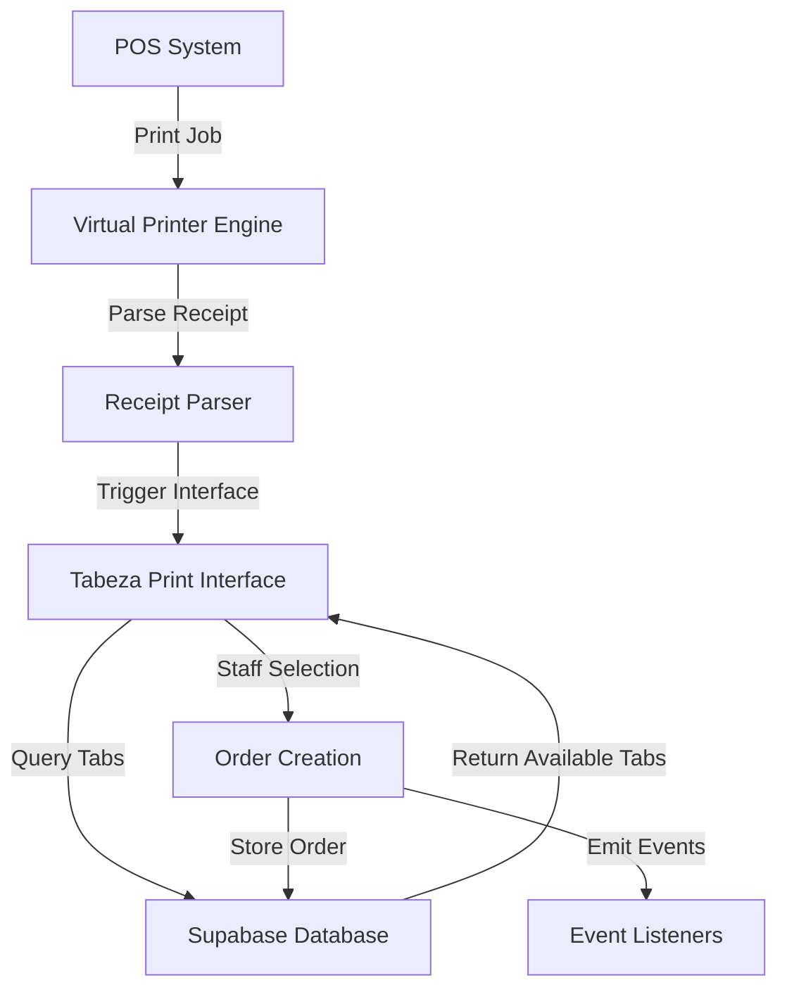

# Design Document: Virtual Printer Completion

## Overview

The Tabeza Virtual Printer system is already implemented with core functionality but requires specific fixes to make it fully functional. This design focuses on completing the existing implementation by fixing TypeScript errors, correcting function signatures, adding missing exports, and ensuring the touch-friendly print interface works correctly with the installed Windows printer.

The system follows an event-driven architecture where POS receipts are intercepted, parsed, and presented to staff through a popup interface for tab selection. The key insight is that POS receipts contain only product information - customer identification comes from staff selecting the appropriate Tabeza tab.

## Architecture

### High-Level Flow
```
POS System → Tabeza Virtual Printer → Receipt Parser → Print Interface → Tab Selection → Order Creation → Database Storage
```

### Component Interaction


### Key Design Principles
1. **Minimal Changes**: Fix existing code without architectural changes
2. **Touch-First UI**: Large buttons optimized for POS touchscreens
3. **Event-Driven**: Maintain existing event emission patterns
4. **Database-Centric**: Use barId to filter and organize data
5. **Error Resilient**: Clear error messages and graceful failures

## Components and Interfaces

### 1. Factory Function Fixes

**Current Issue**: `createVirtualPrinter` expects `merchantId` first, but engine uses `barId`

**Solution**: Update function signature to match actual usage:
```typescript
function createVirtualPrinter(
  barId: string,           // Changed: barId first (not merchantId)
  supabaseUrl: string,
  supabaseKey: string,
  options: {               // Changed: options as 4th parameter
    secretKey?: string;
    forwardToPhysicalPrinter?: boolean;
    generateQRCode?: boolean;
    printerFilters?: string[];
  } = {}
): VirtualPrinterEngine
```

### 2. Tabeza Print Interface Export

**Current Issue**: `WaiterInterface` not exported from main package

**Solution**: Add export to main index.ts:
```typescript
// UI Components
export { TabezaPrintInterface } from './ui/tabeza-print-interface';
export type { TabezaPrintInterfaceConfig, TabOption } from './ui/tabeza-print-interface';
```

**Rename**: `WaiterInterface` → `TabezaPrintInterface` for clarity

### 3. Touch-Friendly Interface Design

**Current Implementation**: Basic HTML popup with small buttons

**Enhanced Design**:
- Large touch targets (minimum 44px height)
- Clear visual hierarchy
- Responsive grid layout for tab buttons
- High contrast colors for visibility
- Cancel button prominently placed

**Tab Display Format**:
```
┌─────────────────────┐
│     Tab 5 (John)    │  ← Large button, clear text
└─────────────────────┘
┌─────────────────────┐
│   Tab 3 (Table 12)  │
└─────────────────────┘
┌─────────────────────┐
│       Tab 7         │  ← No customer identifier
└─────────────────────┘
```

### 4. Receipt Parser Enhancement

**Current State**: Basic parsing with simple regex patterns

**Enhancements Needed**:
- Robust item extraction (name, quantity, unit_price)
- Total calculation and validation
- Tax information extraction (for future tax column)
- Error handling for unparseable receipts

**Data Structure**:
```typescript
interface ParsedReceiptData {
  items: Array<{
    name: string;
    quantity: number;
    unit_price: number;
    total_price: number;
  }>;
  subtotal: number;
  tax?: number;
  total: number;
  rawReceipt: string;
}
```

### 5. Database Integration

**Tab Query Enhancement**:
```sql
SELECT id, tab_number, owner_identifier, status 
FROM tabs 
WHERE bar_id = $1 AND status = 'open' 
ORDER BY tab_number ASC
```

**Order Storage Format**:
```typescript
// tab_orders.items JSONB format
[
  {
    "name": "Chicken Parmesan",
    "quantity": 2,
    "unit_price": 16.00,
    "total_price": 32.00
  },
  {
    "name": "Caesar Salad", 
    "quantity": 1,
    "unit_price": 12.00,
    "total_price": 12.00
  }
]
```

## Data Models

### Configuration Model
```typescript
interface VirtualPrinterConfig {
  barId: string;                    // Primary identifier
  supabaseUrl: string;
  supabaseKey: string;
  printCapture: PrintCaptureConfig;
  dualOutput: DualOutputConfig;
  sync: SyncConfig;
  security: SecurityConfig;
}
```

### Tab Selection Model
```typescript
interface TabOption {
  id: string;                       // UUID
  tab_number: number;               // Display number
  owner_identifier?: string;        // Nickname or table number
  status: 'open';                   // Only open tabs shown
}
```

### Print Interface Events
```typescript
interface PrintInterfaceEvents {
  'waiterActionRequired': {
    receiptData: ParsedReceiptData;
    availableTabs: TabOption[];
    onAction: (action: StaffAction) => void;
  };
  
  'orderSentToCustomer': {
    tabId: string;
    tabNumber: number;
    orderId: string;
    items: ParsedItem[];
    total: number;
  };
  
  'orderCancelled': {
    reason: 'no_tab_selected' | 'staff_cancelled';
  };
}
```

## Correctness Properties

*A property is a characteristic or behavior that should hold true across all valid executions of a system-essentially, a formal statement about what the system should do. Properties serve as the bridge between human-readable specifications and machine-verifiable correctness guarantees.*

Let me analyze the acceptance criteria to determine which ones are testable as properties.

<function_calls>
<invoke name="prework">
<parameter name="featureName">virtual-printer-completion

Based on my prework analysis, I'll now convert the testable acceptance criteria into properties:

**Property 1: Factory function configuration consistency**
*For any* valid barId, supabaseUrl, and supabaseKey, calling createVirtualPrinter should return a VirtualPrinterEngine instance that uses the provided barId for all database operations
**Validates: Requirements 1.3, 1.4**

**Property 2: Constructor parameter validation**
*For any* valid configuration object with callback functions, instantiating TabezaPrintInterface should accept the configuration and provide all expected methods
**Validates: Requirements 2.2**

**Property 3: Receipt processing reliability**
*For any* sample receipt sent to the virtual printer, the system should either successfully parse it and trigger the print interface, or provide clear error messages about parsing failures
**Validates: Requirements 3.3, 8.3**

**Property 4: Event handler type safety**
*For any* event handler definition, the handler function should use parameter types that match the expected event data structure
**Validates: Requirements 4.2**

**Property 5: Callback signature consistency**
*For any* callback function invocation, the parameters passed should match the expected function signature defined in the interface
**Validates: Requirements 4.3**

**Property 6: Print job interception**
*For any* print job sent to the Tabeza virtual printer, the system should intercept it and trigger the print interface with parsed receipt data
**Validates: Requirements 5.1**

**Property 7: Touch-friendly interface rendering**
*For any* print interface display, all tab selection buttons should have minimum 44px height and be optimized for touch interaction
**Validates: Requirements 5.2**

**Property 8: Tab display formatting**
*For any* tab data with optional owner_identifier, the display format should be "Tab X (identifier)" when identifier exists, or "Tab X" when it doesn't
**Validates: Requirements 5.3**

**Property 9: Tab selection order creation**
*For any* staff selection of a customer tab, the system should create an order in that specific tab's record with correct tab_id reference
**Validates: Requirements 5.4**

**Property 10: Receipt parsing completeness**
*For any* POS receipt, the parser should extract item names, quantities, unit prices, and calculate total prices using the formula (quantity × unit_price)
**Validates: Requirements 6.1, 6.2**

**Property 11: Data storage format consistency**
*For any* order storage operation, items should be stored in JSONB format with fields {name, quantity, unit_price, total_price} and totals as numeric(10,2)
**Validates: Requirements 6.3, 7.4, 7.5**

**Property 12: Total calculation accuracy**
*For any* receipt with subtotal, tax, and final total, the parser should extract all values and validate that they sum correctly
**Validates: Requirements 6.4**

**Property 13: Tax information preservation**
*For any* receipt containing tax information, the system should store tax data separately for future tax column integration
**Validates: Requirements 6.5**

**Property 14: Bar-filtered tab queries**
*For any* barId configuration, database queries should return only tabs belonging to that bar with status='open', ordered by tab_number
**Validates: Requirements 7.1, 7.2**

**Property 15: Order storage integrity**
*For any* order creation, the system should store it in tab_orders table with correct tab_id reference and emit success events
**Validates: Requirements 7.3, 9.4**

**Property 16: Parser configuration flexibility**
*For any* POS system receipt format, the parser should support configurable parsing rules that can extract the required fields: item name, quantity, unit price, and total
**Validates: Requirements 8.1**

## Error Handling

### Receipt Parsing Errors
- **Invalid Format**: When receipt format is unrecognizable, provide specific error about missing required fields
- **Missing Items**: When no items can be extracted, display "No items found in receipt" with raw receipt preview
- **Calculation Mismatch**: When item totals don't match receipt total, warn but allow manual override
- **Database Connection**: When Supabase is unreachable, queue operations and retry with exponential backoff

### Interface Errors
- **No Available Tabs**: When no open tabs exist for the bar, display "No open tabs available" with option to cancel
- **Tab Selection Timeout**: When no tab is selected within 60 seconds, automatically cancel and discard receipt
- **Order Creation Failure**: When database insert fails, display error and allow retry or cancel

### System Errors
- **Print Capture Failure**: When Windows print system is unavailable, log error and provide troubleshooting guidance
- **TypeScript Compilation**: When build fails, provide specific line numbers and error descriptions
- **Import Resolution**: When modules can't be imported, check export statements and file paths

## Testing Strategy

### Dual Testing Approach
The testing strategy combines unit tests for specific examples and edge cases with property-based tests for comprehensive input coverage:

**Unit Tests Focus**:
- Specific function signature examples (createVirtualPrinter with correct parameters)
- Import/export verification (TabezaPrintInterface availability)
- Build process validation (TypeScript compilation success)
- Specific workflow examples (Windows printer connection, test receipt processing)
- Error condition examples (cancel action, no tab selection)

**Property Tests Focus**:
- Universal function behavior across all valid inputs
- Receipt parsing across diverse POS formats
- Data storage format consistency for all orders
- Interface rendering properties for all tab configurations
- Database query correctness for all barId values

**Property Test Configuration**:
- Minimum 100 iterations per property test
- Each property test references its design document property
- Tag format: **Feature: virtual-printer-completion, Property {number}: {property_text}**

**Testing Libraries**:
- **Unit Testing**: Jest with ts-jest for TypeScript support
- **Property Testing**: fast-check for property-based testing
- **Integration Testing**: Custom test scripts for end-to-end workflow validation

### Test Coverage Requirements
- All exported functions must have unit tests
- All correctness properties must have corresponding property tests
- Integration tests must cover the complete POS → Interface → Database workflow
- Error handling paths must be tested with both unit and property tests